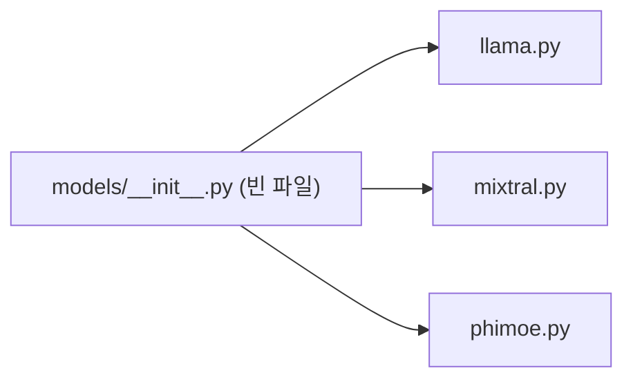

# `profiler/v0/models/__init__.py` 분석

**레거시 v0 프로파일러의 모델 서브패키지 마커**입니다. 파일 내용이 비어 있으며,
HuggingFace 스타일 모델 정의(llama/mixtral/phimoe)를 담는 패키지임을 선언합니다.

## 개요

| 항목 | 내용 |
| --- | --- |
| 역할 | `profiler.v0.models` 패키지 선언(빈 파일) |
| 소속 | 레거시(rewrite 이전) 프로파일러 — 참조용 보존 |

## 블록 다이어그램

## 참고

- v0는 현재 프로파일러(`profiler/core`)로 대체된 레거시 코드로, 참조용으로만
  유지됩니다.
