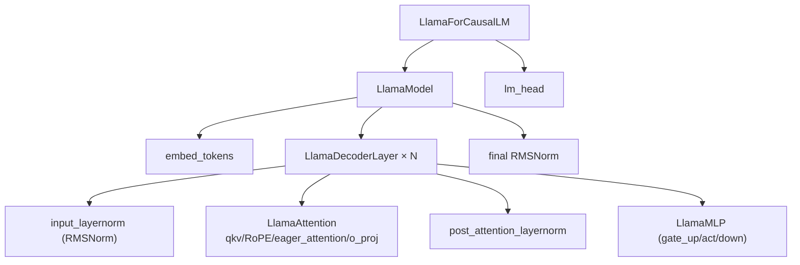

# `profiler/v0/models/llama.py` 분석

**레거시 v0 Llama 모델 정의**입니다(HuggingFace transformers 각색). v0 레이어
프로파일러가 실제 실행하는 Llama 아키텍처 구현으로, RMSNorm·RoPE·MLP·Attention·
DecoderLayer·CausalLM을 포함합니다.

## 개요

| 항목 | 내용 |
| --- | --- |
| 역할 | v0 레이어 프로파일용 Llama forward 구현 |
| 출처 | huggingface/transformers 각색 |
| 소비 | `layers/main.py`의 `run_profile`(model_type='llama') |

## 블록 다이어그램

## 주요 구성 요소

| 요소 | 역할 |
| --- | --- |
| `LlamaRMSNorm` | RMS 정규화 |
| `LlamaRotaryEmbedding` / `apply_rotary_pos_emb` | RoPE 위치 임베딩 |
| `LlamaMLP` | gate_up_proj → act_fn → down_proj |
| `repeat_kv` / `eager_attention_forward` | GQA KV 반복 + eager 어텐션 |
| `LlamaAttention` | qkv_proj/RoPE/어텐션/o_proj |
| `LlamaDecoderLayer` | pre-norm → attn → post-norm → MLP |
| `LlamaModel` / `LlamaForCausalLM` | 전체 스택 + lm_head |

## 참고

- v0 레거시 코드로 참조용으로만 유지됩니다.
- 현재 프로파일러는 자체 모델 정의 대신 실제 vLLM 실행 경로를 프로파일합니다.
