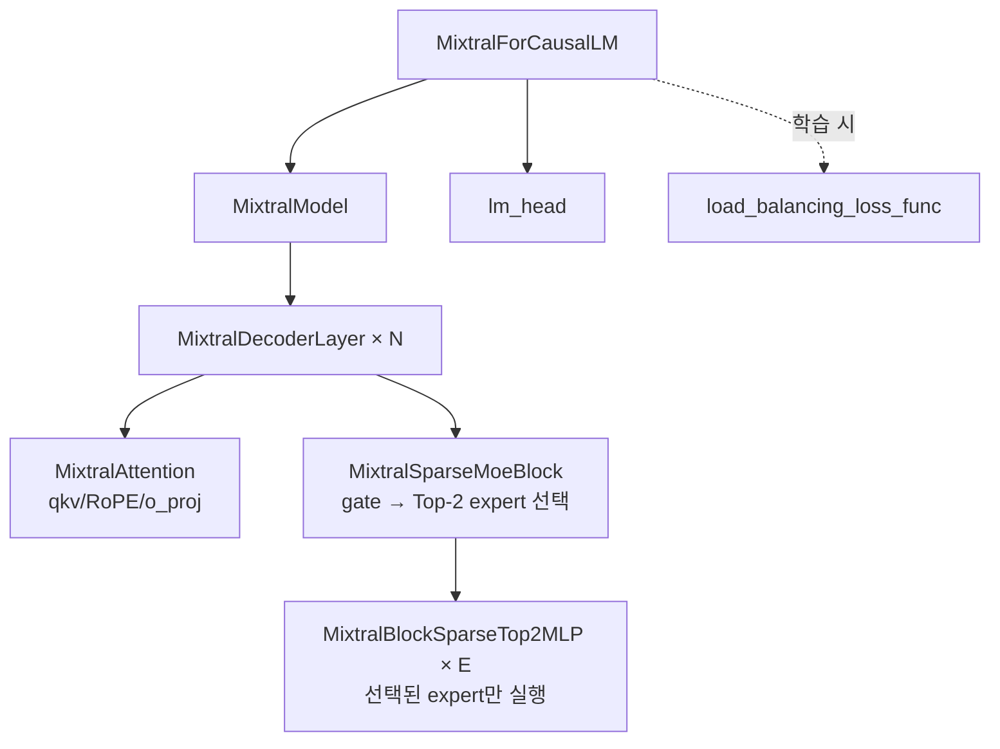

# `profiler/v0/models/mixtral.py` 분석

**레거시 v0 Mixtral(MoE) 모델 정의**입니다(HuggingFace transformers 각색). v0 레이어
프로파일러가 실행하는 Mixtral 아키텍처 구현으로, sparse MoE 블록(Top-2 gate)과
표준 어텐션·DecoderLayer를 포함합니다.

## 개요

| 항목 | 내용 |
| --- | --- |
| 역할 | v0 레이어 프로파일용 Mixtral(MoE) forward 구현 |
| 출처 | huggingface/transformers 각색 |
| 특징 | `MixtralSparseMoeBlock`(Top-2 라우팅), router stats 수집 옵션 |

## 블록 다이어그램

## 주요 구성 요소

| 요소 | 역할 |
| --- | --- |
| `MixtralBlockSparseTop2MLP` | 단일 expert FFN(w1/w2/w3) |
| `MixtralSparseMoeBlock` | gate → Top-2 라우팅 → expert dispatch |
| `MixtralRMSNorm` / `MixtralRotaryEmbedding` | 정규화 + RoPE |
| `MixtralAttention` | qkv/RoPE/GQA/o_proj |
| `MixtralDecoderLayer` | pre-norm → attn → post-norm → MoE |
| `load_balancing_loss_func` | MoE 부하 균형 loss(학습용) |
| `MixtralModel` / `MixtralForCausalLM` | 전체 스택 + lm_head |

## 참고

- v0 레거시 코드로 참조용으로만 유지됩니다.
- `collect_router_stats`로 프로파일 중 라우터 통계 수집을 켤 수 있습니다.
