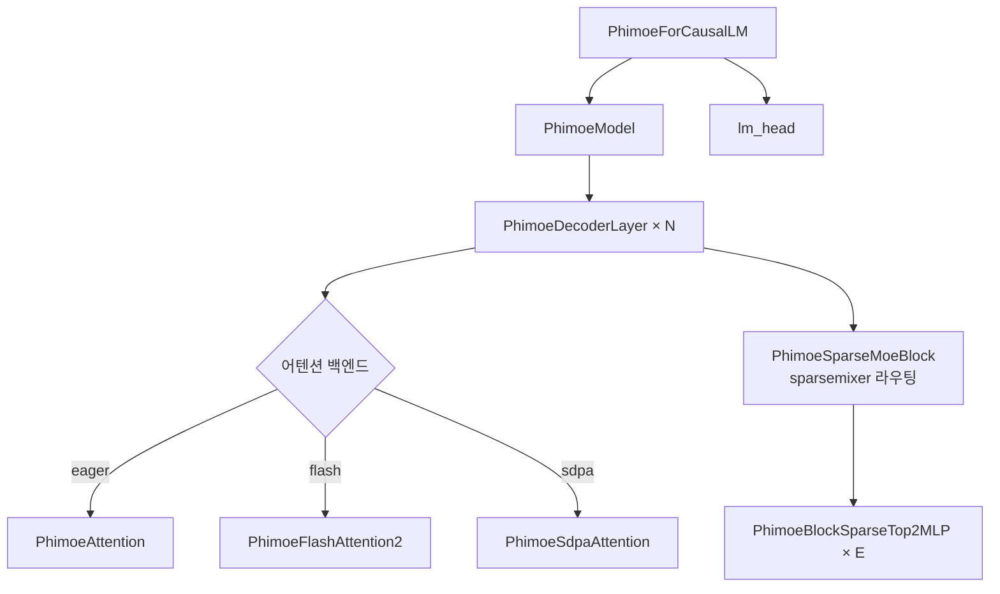

# `profiler/v0/models/phimoe.py` 분석

**레거시 v0 Phi-MoE 모델 정의**입니다(HuggingFace transformers 각색). v0 레이어
프로파일러가 실행하는 Microsoft Phi-MoE 아키텍처 구현으로, sparsemixer 라우팅과
여러 어텐션 백엔드(eager/FlashAttention2/SDPA)를 포함합니다.

## 개요

| 항목 | 내용 |
| --- | --- |
| 역할 | v0 레이어 프로파일용 Phi-MoE(MoE) forward 구현 |
| 출처 | huggingface/transformers 각색 |
| 특징 | `sparsemixer` 라우팅, 3종 어텐션 백엔드, longrope RoPE |

## 블록 다이어그램

## 주요 구성 요소

| 요소 | 역할 |
| --- | --- |
| `PhimoeRotaryEmbedding` / `apply_rotary_pos_emb` | (longrope) RoPE |
| `PhimoeAttention` / `PhimoeFlashAttention2` / `PhimoeSdpaAttention` | 3종 어텐션 백엔드 |
| `sparsemixer` / `MultiplierProcessor` | Phi-MoE 전용 라우팅(autograd Function) |
| `PhimoeSparseMoeBlock` | gate → sparsemixer → expert dispatch |
| `PhimoeBlockSparseTop2MLP` | 단일 expert FFN |
| `PhimoeDecoderLayer` | norm → attn → norm → MoE |
| `load_balancing_loss_func` | MoE 부하 균형 loss |
| `PhimoeModel` / `PhimoeForCausalLM` | 전체 스택 + lm_head + causal mask |

## 참고

- v0 레거시 코드로 참조용으로만 유지됩니다.
- `_update_causal_mask` / `_prepare_4d_causal_attention_mask_with_cache_position`으로
  캐시 위치 기반 4D causal mask를 구성합니다.
