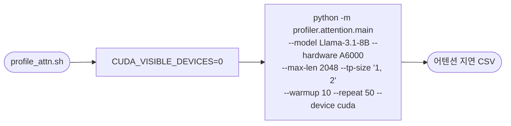

# `profiler/v0/profile_attn.sh` 분석

레거시(v0) 프로파일러로 **어텐션 레이어 지연**을 배치 크기·시퀀스 길이에 걸쳐
측정하는 스크립트입니다. `profiler.attention.main` 모듈을 호출합니다.

## 개요

| 항목 | 내용 |
| --- | --- |
| 목적 | 어텐션 레이어 지연 측정 |
| 모듈 | `profiler.attention.main` (레거시) |
| 대상 | Llama-3.1-8B, A6000, TP=1·2 |
| GPU 고정 | `CUDA_VISIBLE_DEVICES=0` |
| 상태 | 레거시(참조용) |

## 블록 다이어그램

## 주요 인자

| 인자 | 값 | 의미 |
| --- | --- | --- |
| `--max-len` | 2048 | 최대 시퀀스 길이 |
| `--tp-size` | `1, 2` | TP 차수 |
| `--warmup` / `--repeat` | 10 / 50 | 워밍업/반복 측정 횟수(어텐션은 더 촘촘히) |

## 참고

- 비-어텐션 레이어(`profile_layers.sh`)보다 `--repeat`가 크며(50), 어텐션 커널의
  측정 변동을 줄이기 위함입니다.
- 측정 결과는 이후 `build_predictor.sh`의 scikit-learn 예측기 학습에 사용됩니다.
- 신규 vLLM 기반 프로파일러는 4D 통합 어텐션 그리드로 이를 대체했습니다.
