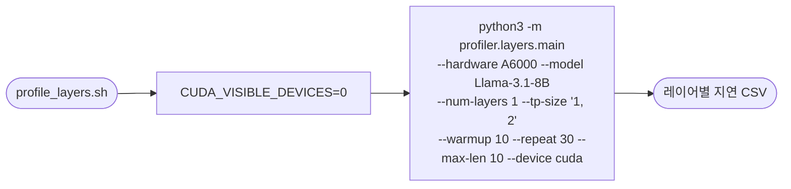

# `profiler/v0/profile_layers.sh` 분석

레거시(v0) 프로파일러로 **비-어텐션 레이어의 계산 지연**을 측정하는 스크립트입니다.
PyTorch Profiler 기반 `profiler.layers.main` 모듈을 호출합니다.

## 개요

| 항목 | 내용 |
| --- | --- |
| 목적 | dense/linear 등 비-어텐션 레이어 지연 측정 |
| 모듈 | `profiler.layers.main` (레거시) |
| 대상 | Llama-3.1-8B, A6000, TP=1·2 |
| GPU 고정 | `CUDA_VISIBLE_DEVICES=0` |
| 상태 | 레거시(참조용) |

## 블록 다이어그램

## 주요 인자

| 인자 | 값 | 의미 |
| --- | --- | --- |
| `--hardware` | A6000 | 하드웨어 라벨 |
| `--num-layers` | 1 | 프로파일할 레이어 수(시간 단축) |
| `--tp-size` | `1, 2` | TP 차수 |
| `--warmup` / `--repeat` | 10 / 30 | 워밍업/반복 측정 횟수 |
| `--max-len` | 10 | 최대 길이 |

## 참고

- GPU 0만 사용하도록 `CUDA_VISIBLE_DEVICES=0`을 앞에 붙입니다.
- 어텐션 레이어는 `profile_attn.sh`로 별도 측정합니다.
- 신규 프로파일러(vLLM 기반)는 dense/attention/moe를 통합 파이프라인으로 처리합니다.
