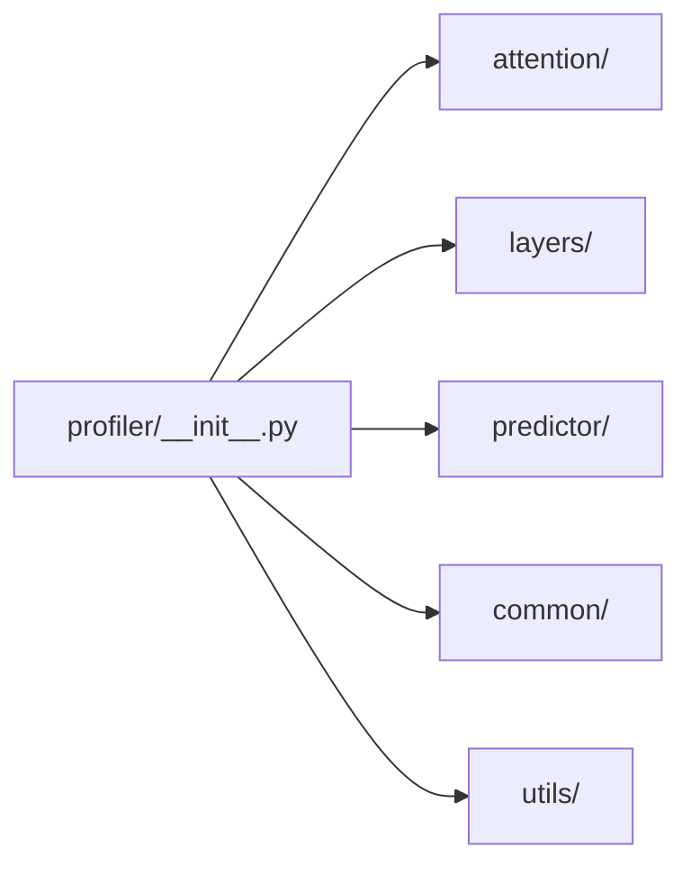

# `profiler/v0/profiler/__init__.py` 분석

**레거시 v0 프로파일러 서브패키지 마커**입니다. 파일이 비어 있으며,
attention/layers/predictor/common/utils 하위 모듈을 담는 패키지임을 선언합니다.

## 개요

| 항목 | 내용 |
| --- | --- |
| 역할 | `profiler.v0.profiler` 패키지 선언(빈 파일) |
| 하위 | attention · layers · predictor · common · utils |

## 블록 다이어그램

## 참고

- v0는 vidur(microsoft) 기반의 레거시 프로파일러로 참조용으로만 유지됩니다.
