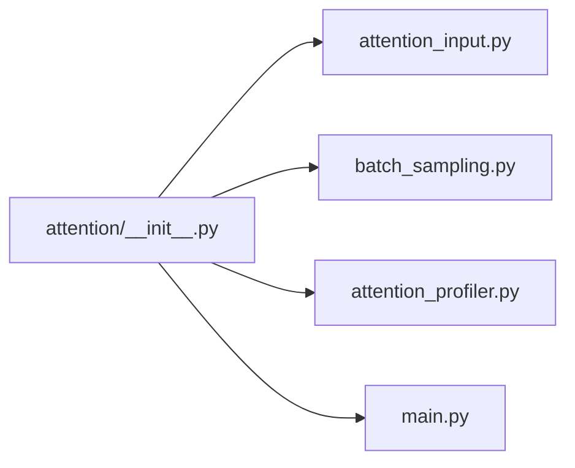

# `profiler/v0/profiler/attention/__init__.py` 분석

**레거시 v0 어텐션 프로파일 서브패키지 마커**입니다(빈 파일). FlashAttention
커널 지연 프로파일러(`attention_profiler`, `batch_sampling`, `attention_input`,
`main`)를 담습니다.

## 개요

| 항목 | 내용 |
| --- | --- |
| 역할 | `profiler.v0.profiler.attention` 패키지 선언(빈 파일) |
| 하위 | attention_input · batch_sampling · attention_profiler · main |

## 블록 다이어그램

## 참고

- v0 레거시 코드로 참조용으로만 유지됩니다.
