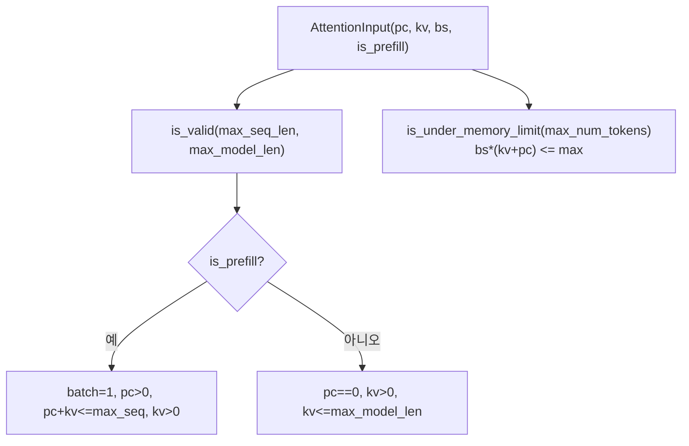

# `profiler/v0/profiler/attention/attention_input.py` 분석

**레거시 v0 어텐션 입력 기술자**입니다(vidur 기반). 하나의 어텐션 프로파일 shot의
형태(prefill chunk / kv cache / batch / prefill 여부)를 표현하고 유효성·메모리
제약을 검사합니다.

## 개요

| 항목 | 내용 |
| --- | --- |
| 역할 | 어텐션 shot 형태 기술 + 유효성 검사 |
| 클래스 | `AttentionInput` |
| 필드 | prefill_chunk_size, kv_cache_size, batch_size, is_prefill |

## 블록 다이어그램

## 주요 구성 요소

| 요소 | 역할 |
| --- | --- |
| `AttentionInput` | shot 형태(pc/kv/batch/is_prefill) |
| `is_valid` | prefill/decode 별 형태 유효성 검사 |
| `is_under_memory_limit` | KV+prefill 토큰이 메모리 한도 이내인지 |

## 참고

- v0 레거시 코드로 참조용으로만 유지됩니다.
