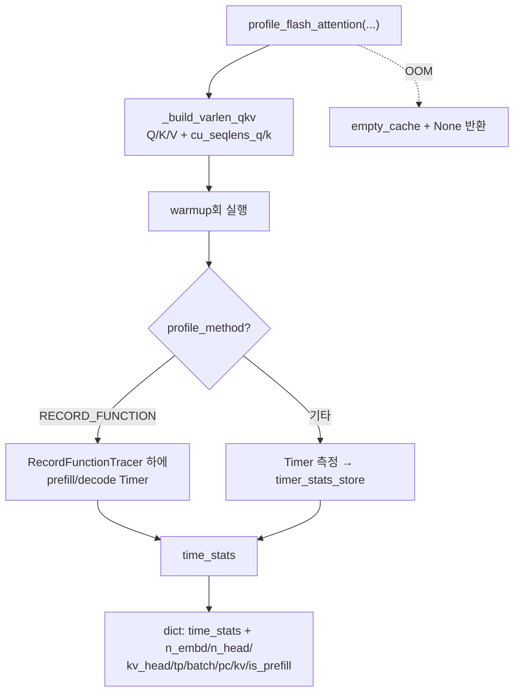

# `profiler/v0/profiler/attention/attention_profiler.py` 분석

**레거시 v0 FlashAttention 커널 프로파일러**입니다. 샘플된 길이로 varlen Q/K/V와
`cu_seqlens`를 만들어 `flash_attn_varlen_func` 지연을 측정하고 메타데이터와 함께
반환합니다.

## 개요

| 항목 | 내용 |
| --- | --- |
| 역할 | FlashAttention varlen 커널 지연 측정 |
| 커널 | `flash_attn_varlen_func`(FA2, causal) |
| 측정 | warmup 후 repeat회, Timer/RecordFunctionTracer로 |
| 반환 | time_stats + 모델/배치 메타데이터 dict |

## 블록 다이어그램

## 주요 구성 요소

| 요소 | 역할 |
| --- | --- |
| `_build_varlen_qkv` | 샘플 길이로 varlen Q/K/V + cu_seqlens 텐서 구성(per-rank head) |
| `profile_flash_attention` | warmup + repeat 측정, 메타데이터 dict 반환(OOM 시 None) |

## 참고

- v0 레거시 코드로 참조용으로만 유지됩니다.
- head는 TP로 나눠 per-rank shape를 재현합니다(현재 프로파일러의 hf_overrides
  방식과 다른 접근).
