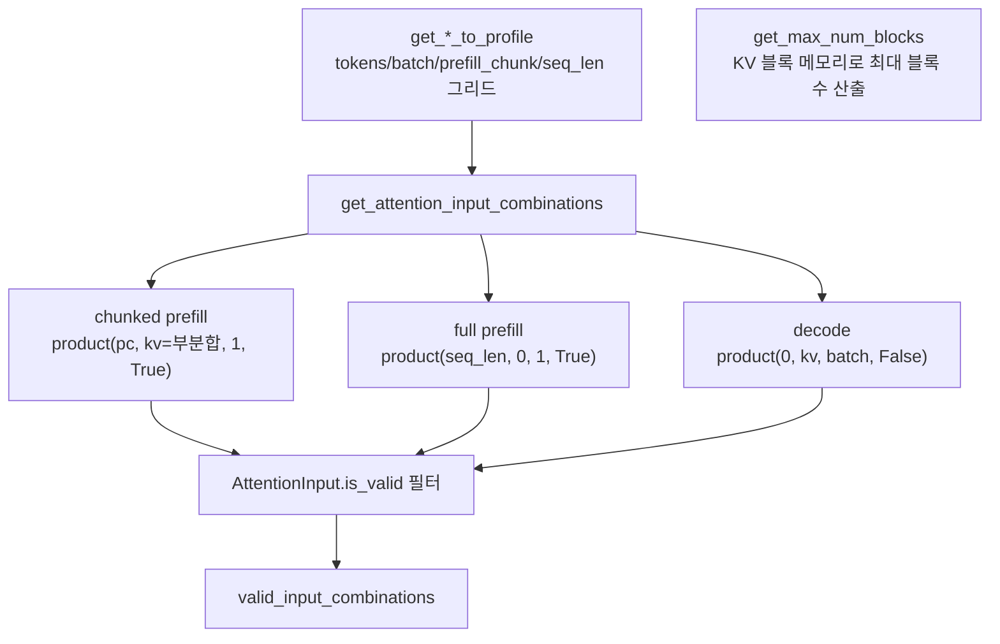

# `profiler/v0/profiler/attention/batch_sampling.py` 분석

**레거시 v0 어텐션 배치 샘플링**입니다(vidur 기반). 프로파일할 토큰 수/배치 크기/
prefill chunk/시퀀스 길이 그리드를 생성하고, 유효한 `AttentionInput` 조합
(chunked prefill / full prefill / decode)을 조합합니다.

## 개요

| 항목 | 내용 |
| --- | --- |
| 역할 | 어텐션 스윕 그리드 + 유효 입력 조합 생성 |
| 그리드 | 저역 촘촘·고역 성긴 계단형 |
| 조합 | chunked prefill + full prefill + decode |

## 블록 다이어그램

## 주요 구성 요소

| 요소 | 역할 |
| --- | --- |
| `get_num_tokens_to_profile` | 토큰 수 그리드(계단형, 역순 정렬) |
| `get_attention_batch_sizes_to_profile` | 배치 크기 그리드(min~max 필터) |
| `get_attention_prefill_chunk_sizes_to_profile` | prefill chunk 그리드 |
| `get_seq_lengths_to_profile` | 시퀀스 길이 그리드 |
| `get_attention_input_combinations` | 세 유형 조합 생성 + 유효성 필터 |
| `get_max_num_blocks` | 모델/TP/블록 크기로 GPU 최대 KV 블록 수 계산 |

## 참고

- v0 레거시 코드로 참조용으로만 유지됩니다.
