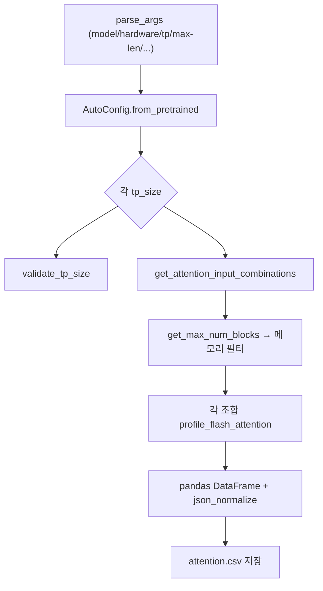

# `profiler/v0/profiler/attention/main.py` 분석

**레거시 v0 어텐션 프로파일 CLI 진입점**입니다. 모델 config를 로드하고 TP별로
유효 입력 조합을 생성하여 각 조합을 `profile_flash_attention`으로 측정한 뒤
`attention.csv`로 저장합니다.

## 개요

| 항목 | 내용 |
| --- | --- |
| 역할 | 어텐션 프로파일 스윕 오케스트레이션 → CSV |
| 진입 함수 | `main()` |
| 출력 | `perf_models/<hw>/<model>/tp<N>/attention.csv` |

## 블록 다이어그램

## 주요 구성 요소

| 요소 | 역할 |
| --- | --- |
| `parse_args` | CLI 인자(model/hardware/tp-size/max-len/batch/warmup/repeat/profile-method) |
| `main` | config 로드 → TP별 조합 생성·필터 → 측정 → CSV flatten 저장 |

## 참고

- v0 레거시 코드로 참조용으로만 유지됩니다.
- `time_stats`는 `json_normalize`로 평탄화되어 CSV 컬럼이 됩니다.
