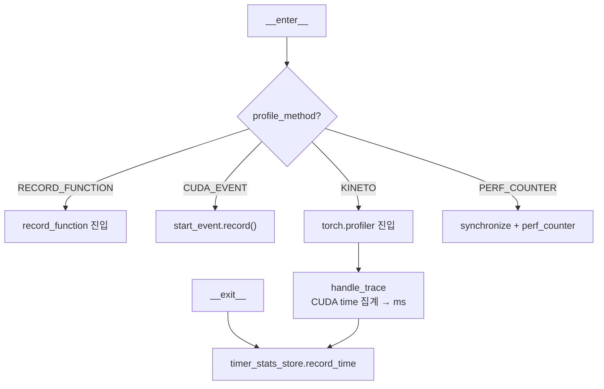

# `profiler/v0/profiler/common/timer.py` 분석

**레거시 v0 커널 타이머**입니다(vidur 기반). 컨텍스트 매니저로 GPU 커널 구간을
측정하며, `ProfileMethod`에 따라 record_function / CUDA event / KINETO /
perf_counter 방식을 선택합니다.

## 개요

| 항목 | 내용 |
| --- | --- |
| 역할 | 프로파일 방식별 커널 시간 측정 컨텍스트 매니저 |
| 클래스 | `Timer` |
| 저장 | `TimerStatsStore`에 시간 기록 |
| 방식 | RECORD_FUNCTION / CUDA_EVENT / KINETO / PERF_COUNTER |

## 블록 다이어그램

## 주요 구성 요소

| 요소 | 역할 |
| --- | --- |
| `Timer.__enter__`/`__exit__` | 방식별 측정 시작/종료 후 `record_time` 호출 |
| `handle_trace` | KINETO trace에서 device time 집계(ms 변환) |

## 참고

- v0 레거시 코드로 참조용으로만 유지됩니다.
- `name=None`이거나 store가 disabled면 측정을 건너뜁니다.
