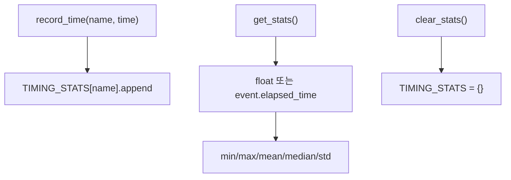

# `profiler/v0/profiler/common/timer_stats_store.py` 분석

**레거시 v0 타이밍 통계 저장소**입니다(vidur 기반). `Singleton` 메타클래스로 전역
단일 인스턴스를 유지하며, `Timer`가 기록한 시간을 이름별로 모아 min/max/mean/
median/std를 산출합니다.

## 개요

| 항목 | 내용 |
| --- | --- |
| 역할 | 이름별 시간 누적 + 통계 산출 |
| 클래스 | `TimerStatsStore`(Singleton) |
| CUDA event | `start.elapsed_time(end)`로 지연 계산 |

## 블록 다이어그램

## 주요 구성 요소

| 요소 | 역할 |
| --- | --- |
| `record_time` | 이름별 시간(또는 CUDA event 쌍) 누적 |
| `get_stats` | event 쌍은 elapsed_time으로 변환 후 통계 산출 |
| `clear_stats` | 누적 초기화 |

## 참고

- v0 레거시 코드로 참조용으로만 유지됩니다.
- Singleton이라 `Timer` 여러 개가 동일 store를 공유합니다.
