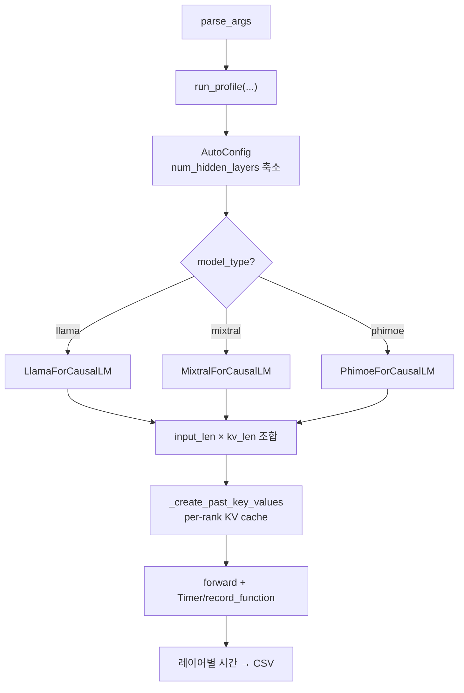

# `profiler/v0/profiler/layers/main.py` 분석

**레거시 v0 비-어텐션 레이어 프로파일러**입니다. HuggingFace 스타일 모델
정의(llama/mixtral/phimoe)를 단일 레이어로 축소해 실행하며, 각 레이어의 record_function
구간 시간을 측정하여 CSV로 저장합니다.

## 개요

| 항목 | 내용 |
| --- | --- |
| 역할 | qkv/o/MLP/norm 등 비-어텐션 레이어 지연 프로파일 |
| 진입 함수 | `main()` → `run_profile()` |
| 모델 | llama / mixtral / phimoe(model_type로 분기) |
| 측정 | record_function 구간별 CUDA 시간 |

## 블록 다이어그램

## 주요 구성 요소

| 요소 | 역할 |
| --- | --- |
| `parse_args` | CLI 인자(model/hardware/num-layers/tp-size/max-len/...) |
| `_create_past_key_values` | per-rank KV cache(DynamicCache) 사전 할당 |
| `run_profile` | model_type별 모델 인스턴스화 → 조합별 forward 측정 |
| `main` | TP별 run_profile 오케스트레이션 |

## 참고

- v0 레거시 코드로 참조용으로만 유지됩니다.
- 현재 프로파일러는 실제 vLLM 실행 경로의 layerwise_profile을 사용하나, v0는 자체
  포팅한 모델 정의를 직접 실행합니다.
