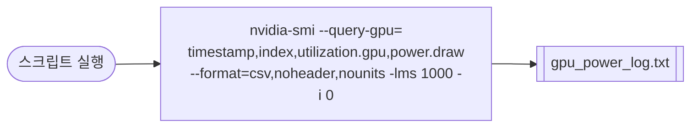

# `profiler/v0/profiler/power/profile_gpu_power.sh` 분석

레거시(v0) 트리에 있는 **GPU 전력 로깅** 헬퍼입니다. 내용은 현행
`profiler/power/profile_gpu_power.sh`와 **동일**합니다.

## 개요

| 항목 | 내용 |
| --- | --- |
| 목적 | `nvidia-smi`로 GPU 전력/사용률을 1초 간격 CSV 로깅 |
| 출력 | `gpu_power_log.txt` |
| 대상 GPU | 인덱스 0 |
| 상태 | 레거시(참조용) |

## 블록 다이어그램

## 분석

- `--query-gpu`로 타임스탬프·인덱스·사용률·전력을 조회하고, `--format=csv,noheader,nounits`로
  파싱하기 쉬운 CSV를 출력하며, `-lms 1000`(1초 간격), `-i 0`(GPU 0)으로 반복
  측정하여 파일로 리다이렉트합니다.

## 참고

- 현행 버전(`profiler/power/profile_gpu_power.sh`)과 동일하므로 상세 설명은 해당
  문서를 참고하세요.
- 시스템 전체 전력은 같은 디렉터리의 `profile_server_power.sh`(IPMI)를 함께
  사용합니다.
