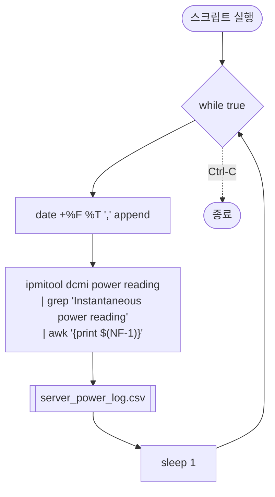

# `profiler/v0/profiler/power/profile_server_power.sh` 분석

레거시(v0) 트리에 있는 **서버(시스템) 전력 로깅** 헬퍼입니다. 내용은 현행
`profiler/power/profile_server_power.sh`와 **동일**합니다.

## 개요

| 항목 | 내용 |
| --- | --- |
| 목적 | `ipmitool`로 시스템 순간 전력을 1초 간격 CSV 로깅 |
| 출력 | `server_power_log.csv` |
| 구조 | 무한 루프 |
| 상태 | 레거시(참조용) |

## 블록 다이어그램

## 분석

- 무한 루프 안에서 타임스탬프를 개행 없이 append하고, `ipmitool dcmi power
  reading`의 "Instantaneous power reading" 라인에서 `awk '{print $(NF-1)}'`로
  전력값을 추출한 뒤 `sleep 1`로 대기합니다.

## 참고

- 현행 버전(`profiler/power/profile_server_power.sh`)과 동일하므로 상세 설명은 해당
  문서를 참고하세요.
- IPMI(BMC) 접근 권한이 필요하며 보통 root/sudo로 실행합니다.
