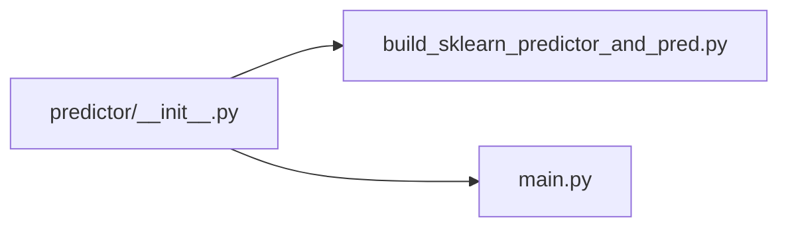

# `profiler/v0/profiler/predictor/__init__.py` 분석

**레거시 v0 예측기 서브패키지 마커**입니다(빈 파일). 프로파일된 어텐션 데이터로
sklearn RandomForest 예측기를 학습하고 예측 테이블을 생성하는 모듈
(`build_sklearn_predictor_and_pred`, `main`)을 담습니다.

## 개요

| 항목 | 내용 |
| --- | --- |
| 역할 | `profiler.v0.profiler.predictor` 패키지 선언(빈 파일) |
| 하위 | build_sklearn_predictor_and_pred · main |

## 블록 다이어그램

## 참고

- v0 레거시 코드로 참조용으로만 유지됩니다.
