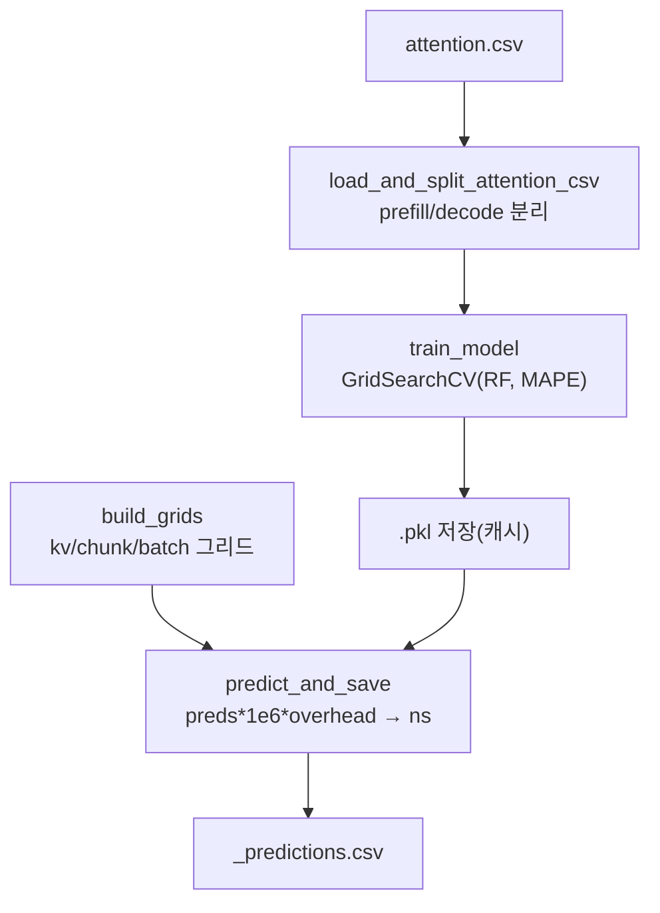

# `profiler/v0/profiler/predictor/build_sklearn_predictor_and_pred.py` 분석

**레거시 v0 sklearn 예측기 빌더**입니다. 프로파일된 어텐션 CSV로 RandomForest
회귀 모델을 GridSearchCV(MAPE 스코어)로 학습하고, 그리드에 대해 예측하여 예측
테이블 CSV를 저장합니다.

## 개요

| 항목 | 내용 |
| --- | --- |
| 역할 | 어텐션 지연 RandomForest 예측기 학습 + 예측 테이블 생성 |
| 모델 | `RandomForestRegressor` + GridSearchCV |
| 스코어 | MAPE(`_mape`, greater_is_better=False) |

## 블록 다이어그램

## 주요 구성 요소

| 요소 | 역할 |
| --- | --- |
| `_mape` / `SCORER` | MAPE 계산 + sklearn scorer |
| `train_model` | GridSearchCV로 RF 학습(기존 pkl 있으면 로드) |
| `predict_and_save` | 그리드 예측 → ns 변환 → CSV 저장 |
| `load_and_split_attention_csv` | CSV를 prefill/decode로 분리 |
| `build_grids` | prefill(kv×chunk)/decode(batch×kv) 예측 그리드 생성 |

## 참고

- v0 레거시 코드로 참조용으로만 유지됩니다.
- 현재 시뮬레이터는 예측기 대신 프로파일 CSV를 직접 보간(interpolation)합니다.
