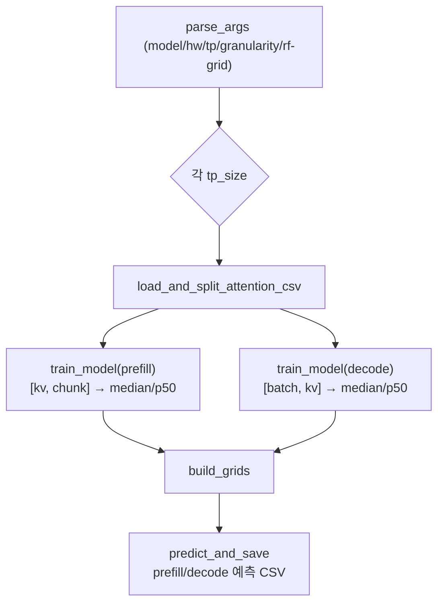

# `profiler/v0/profiler/predictor/main.py` 분석

**레거시 v0 예측기 빌드 CLI 진입점**입니다. TP별로 프로파일된 `attention.csv`를
읽어 prefill/decode RandomForest 예측기를 학습하고 예측 테이블 CSV를 생성합니다.

## 개요

| 항목 | 내용 |
| --- | --- |
| 역할 | 어텐션 예측기 학습 + 예측 CSV 생성 오케스트레이션 |
| 진입 함수 | `main()` |
| 입력 | `perf_models/<hw>/<model>/tp<N>/attention.csv` |
| 출력 | `tp<N>/predictions/{attn_prefill,attn_decode}_*.pkl/.csv` |

## 블록 다이어그램

## 주요 구성 요소

| 요소 | 역할 |
| --- | --- |
| `parse_args` | CLI 인자(model/hardware/tp/granularity/RF 하이퍼파라미터) |
| `main` | TP별 학습·예측 오케스트레이션(TPU는 p50_ns 타깃) |

## 참고

- v0 레거시 코드로 참조용으로만 유지됩니다.
- TPU 하드웨어는 `p50_ns`, 그 외는 `time_stats.attn_*.median`을 예측 타깃으로 씁니다.
