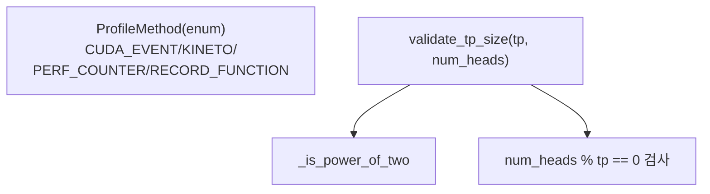

# `profiler/v0/profiler/utils/__init__.py` 분석

**레거시 v0 유틸 서브패키지 초기화**입니다. 프로파일 방식 enum(`ProfileMethod`)과
TP 크기 검증 헬퍼를 정의합니다(vidur 기반).

## 개요

| 항목 | 내용 |
| --- | --- |
| 역할 | `ProfileMethod` enum + TP 검증 유틸 |
| 출처 | microsoft/vidur 각색 |

## 블록 다이어그램

## 주요 구성 요소

| 요소 | 역할 |
| --- | --- |
| `ProfileMethod` | 프로파일 측정 방식 enum(cuda_event/kineto/perf_counter/record_function) |
| `_is_power_of_two` | 2의 거듭제곱 판별 |
| `validate_tp_size` | TP 차수 유효성(2의 거듭제곱 + num_heads 나눔) 검증 |

## 참고

- v0 레거시 코드로 참조용으로만 유지됩니다.
