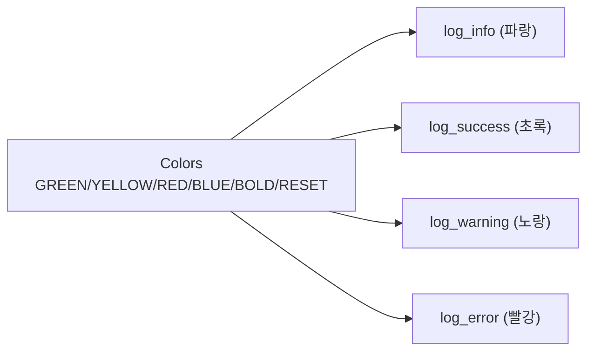

# `profiler/v0/profiler/utils/logger.py` 분석

**레거시 v0 ANSI 컬러 로거**입니다. 터미널 출력용 ANSI 색상 상수와 간단한
레벨별 print 헬퍼(info/success/warning/error)를 제공합니다.

## 개요

| 항목 | 내용 |
| --- | --- |
| 역할 | ANSI 색상 print 헬퍼 |
| 클래스/함수 | `Colors`, `log_info/success/warning/error` |

## 블록 다이어그램

## 주요 구성 요소

| 요소 | 역할 |
| --- | --- |
| `Colors` | ANSI 이스케이프 색상 상수 |
| `log_info`/`log_success`/`log_warning`/`log_error` | 레벨별 색상 print |

## 참고

- v0 레거시 코드로 참조용으로만 유지됩니다(현재 프로파일러는 rich 기반 로거 사용).
