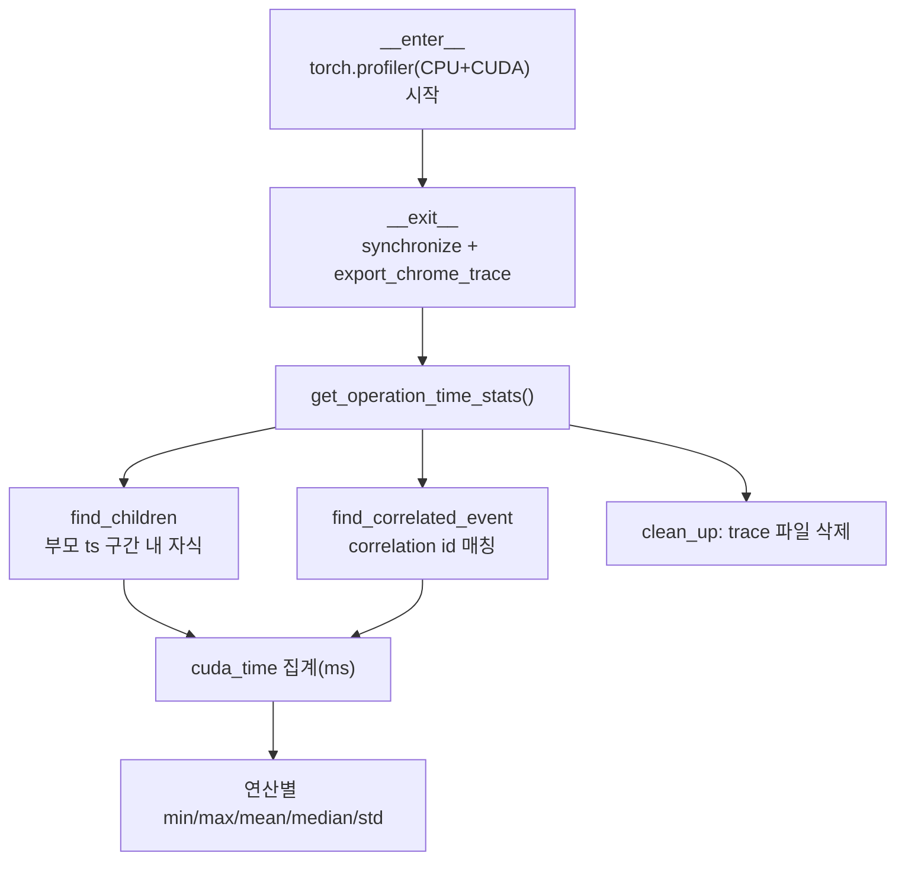

# `profiler/v0/profiler/utils/record_function_tracer.py` 분석

**레거시 v0 record_function 트레이서**입니다(vidur 기반). `torch.profiler`로
Chrome trace를 생성하고, user_annotation 이벤트별로 상관된 CUDA runtime 자식
이벤트의 시간을 집계하여 연산별 통계를 산출합니다.

## 개요

| 항목 | 내용 |
| --- | --- |
| 역할 | Chrome trace 기록 + 연산별 CUDA 시간 집계 |
| 클래스 | `RecordFunctionTracer` |
| 출력 | `profiler_traces/profiler_trace_<id>.json` |

## 블록 다이어그램

## 주요 구성 요소

| 요소 | 역할 |
| --- | --- |
| `__enter__`/`__exit__` | CPU+CUDA 프로파일 후 Chrome trace 저장 |
| `find_children` | 부모 이벤트 시간 구간 내 자식 이벤트 탐색 |
| `find_correlated_event` | correlation id로 상관 이벤트 매칭 |
| `get_operation_time_stats` | user_annotation별 CUDA 시간 집계·통계 |
| `clean_up` | trace JSON 파일 삭제 |

## 참고

- v0 레거시 코드로 참조용으로만 유지됩니다.
- `vidur_` 접두어를 연산명에서 제거하며 시간은 ms로 변환합니다.
