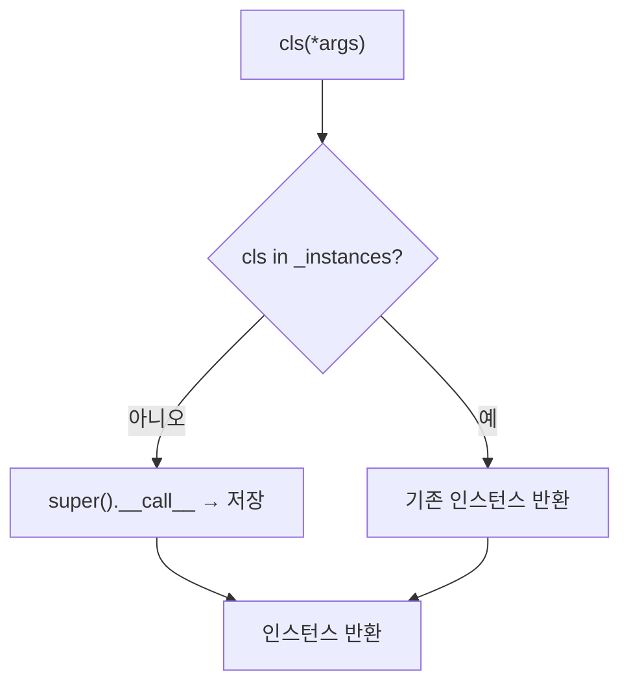

# `profiler/v0/profiler/utils/singleton.py` 분석

**레거시 v0 Singleton 메타클래스**입니다(vidur 기반). 클래스당 단일 인스턴스만
생성되도록 보장합니다. `TimerStatsStore`가 이 메타클래스를 사용합니다.

## 개요

| 항목 | 내용 |
| --- | --- |
| 역할 | 클래스당 단일 인스턴스 보장 메타클래스 |
| 클래스 | `Singleton(type)` |

## 블록 다이어그램

## 주요 구성 요소

| 요소 | 역할 |
| --- | --- |
| `Singleton.__call__` | `_instances` 캐시로 클래스당 1회만 생성 |

## 참고

- v0 레거시 코드로 참조용으로만 유지됩니다.
