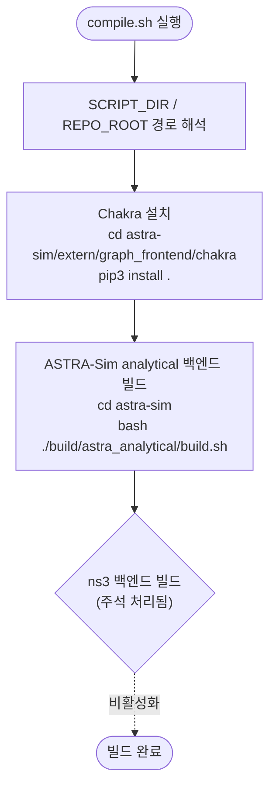

# `scripts/compile.sh` 분석

ASTRA-Sim의 **analytical 백엔드**를 빌드하고 **Chakra 트레이스 변환기**를 설치하는
빌드 스크립트입니다. 시뮬레이터 컨테이너(또는 베어메탈)에서 최초 1회 실행합니다.

## 개요

| 항목 | 내용 |
| --- | --- |
| 목적 | ASTRA-Sim(C++ 백엔드) + Chakra(Python 변환기) 빌드/설치 |
| 실행 위치 | sim Docker 컨테이너 내부 또는 베어메탈(`install-sim.sh`가 호출) |
| 전제 조건 | ASTRA-Sim 서브모듈 체크아웃 완료, C++ 빌드 툴체인(cmake, g++, protobuf) |
| 핵심 옵션 | `set -e` — 어느 단계든 실패하면 즉시 중단 |

## 블록 다이어그램

## 단계별 분석

1. **경로 해석** — `realpath`로 스크립트 위치를 찾아 `REPO_ROOT`(저장소 루트)를
   계산합니다. 어디서 호출해도 경로가 저장소 루트로 해석됩니다.
2. **Chakra 설치** — ASTRA-Sim 저장소에 포함된 Chakra fork를
   `pip3 install .`로 설치합니다. 서브셸 `( ... )`을 사용하여 `cd`가 스크립트
   전역에 영향을 주지 않도록 격리합니다.
3. **ASTRA-Sim analytical 빌드** — `build/astra_analytical/build.sh`를 실행하여
   시뮬레이터가 사용하는 analytical 네트워크 백엔드 바이너리를 컴파일합니다.
4. **ns3 백엔드(비활성화)** — ns3 백엔드 빌드는 주석 처리되어 있습니다(WIP).
   필요 시 주석을 해제합니다.

## 참고

- **`set -e`** 때문에 Chakra 설치나 ASTRA-Sim 빌드 중 하나라도 실패하면 스크립트가
  즉시 종료됩니다.
- ASTRA-Sim C++ 소스를 수정한 경우 이 스크립트를 재실행하여 재빌드해야 합니다.
- 빌드 실패의 가장 흔한 원인은 서브모듈 미체크아웃입니다 — `git submodule update
  --init --recursive`를 먼저 실행하세요.
