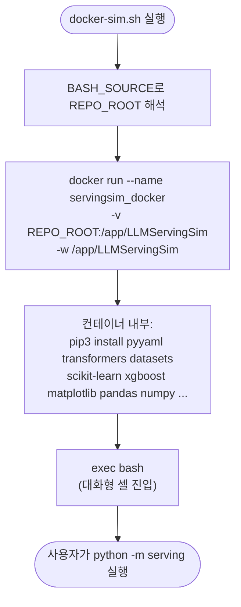

# `scripts/docker-sim.sh` 분석

**시뮬레이터 Docker 컨테이너**(ASTRA-Sim + 시뮬레이터 Python 의존성)를 실행하는
호스트 측 런처입니다. 저장소 루트를 컨테이너에 마운트하고 Python 패키지를 설치한 뒤
대화형 셸로 진입합니다.

## 개요

| 항목 | 내용 |
| --- | --- |
| 목적 | 시뮬레이터 실행 환경(ASTRA-Sim 백엔드) 컨테이너 기동 |
| 이미지 | `astrasim/tutorial-micro2024` |
| 마운트 | 저장소 루트 → `/app/LLMServingSim` (bind mount) |
| 작업 디렉터리 | `/app/LLMServingSim` |
| 안전 옵션 | `set -euo pipefail` — 오류/미정의 변수/파이프 실패 시 중단 |

## 블록 다이어그램

## 단계별 분석

1. **경로 해석** — `BASH_SOURCE[0]`로 스크립트 위치를 찾아 저장소 루트를 계산합니다.
   호출 위치와 무관하게 저장소 루트를 마운트합니다.
2. **`docker run`** — 컨테이너를 `servingsim_docker`라는 이름으로 대화형(`-it`)
   실행하고, 저장소를 `/app/LLMServingSim`에 bind mount하며 작업 디렉터리로 지정합니다.
   호스트의 편집이 컨테이너 내부에 즉시 반영됩니다.
3. **Python 의존성 설치** — 컨테이너 기동 시 `pip3 install`로 버전 고정된 패키지
   (`numpy==1.23.5`, `pandas==1.5.3`, `matplotlib==3.5.3`, `xgboost==3.1.2` 등)를
   설치합니다. 이 버전들은 컨테이너의 구버전 Python에 맞춰져 있습니다.
4. **`exec bash`** — 설치 후 대화형 셸로 대체하여 사용자가 시뮬레이션을 실행할 수
   있게 합니다.

## 참고

- 컨테이너 이름이 이미 사용 중이면(`servingsim_docker` 존재) 재연결(`docker start
  -ai servingsim_docker`)하거나 제거(`docker rm -f servingsim_docker`) 후 재실행하세요.
- 최초 진입 후에는 `scripts/compile.sh`로 ASTRA-Sim + Chakra를 빌드해야 합니다.
- GPU 불필요 — 시뮬레이터는 CPU에서 실행됩니다(프로파일러/bench와 달리).
