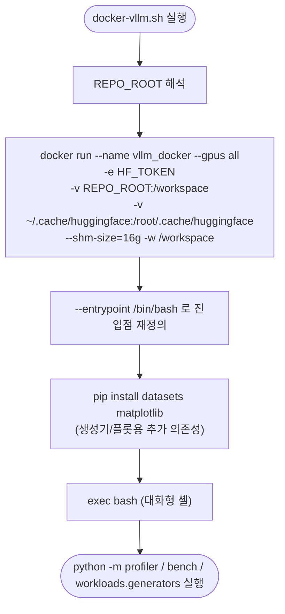

# `scripts/docker-vllm.sh` 분석

**vLLM Docker 컨테이너**를 실행하는 호스트 측 런처입니다. 프로파일러, bench,
워크로드 생성기가 모두 실제 GPU + vLLM을 필요로 하므로 이 컨테이너에서 실행합니다.

## 개요

| 항목 | 내용 |
| --- | --- |
| 목적 | 프로파일링 / bench / 워크로드 생성용 GPU + vLLM 환경 기동 |
| 이미지 | `vllm/vllm-openai:v0.19.0` |
| GPU | `--gpus all` (전체 GPU 노출) |
| 마운트 | 저장소 루트 → `/workspace`, HF 캐시 → `/root/.cache/huggingface` |
| 환경 변수 | `HF_TOKEN`(게이트 모델 자동 다운로드용) |
| 기타 | `--shm-size=16g`(멀티 GPU 통신용 공유 메모리) |

## 블록 다이어그램

## 단계별 분석

1. **경로 해석** — 저장소 루트를 `/workspace`에 마운트합니다. 컨테이너 작업
   디렉터리가 `/workspace`이므로 `python -m profiler …`, `python -m bench …` 등을
   바로 실행할 수 있습니다.
2. **`docker run`** — 전체 GPU를 노출(`--gpus all`)하고, HF 토큰을 환경 변수로
   전달하며, HuggingFace 캐시를 호스트와 공유하여 모델 재다운로드를 방지합니다.
   `--shm-size=16g`는 텐서 병렬 통신에 필요한 공유 메모리입니다.
3. **진입점 재정의 + 추가 설치** — vLLM 공식 이미지의 기본 진입점을 `/bin/bash`로
   덮어쓰고, 워크로드 생성기(HF `datasets`)와 bench 플롯(`matplotlib`)에 필요한
   추가 패키지를 설치합니다. vllm/pydantic/pyyaml/rich/huggingface_hub는 이미지에
   포함되어 있어 별도 설치가 불필요합니다.
4. **`exec bash`** — 대화형 셸로 진입합니다.

## 참고

- 게이트 모델(Llama 3.x 등)을 프로파일하려면 실행 전 셸에서 `export HF_TOKEN=...`를
  설정하세요. `${HF_TOKEN:-}`로 미설정 시 빈 문자열로 전달됩니다.
- CUDA 13.x GPU는 이미지 태그를 `v0.19.0-cu130`으로 변경하세요.
- 특정 GPU만 사용하려면 `--gpus all`을 `--gpus '"device=0,1"'`로 제한하세요.
