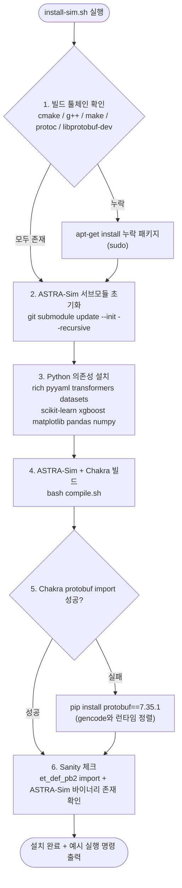

# `scripts/install-sim.sh` 분석

**시뮬레이터(ASTRA-Sim 백엔드)를 베어메탈에 설치**하는 헬퍼입니다.
`docker-sim.sh`가 하는 일을 컨테이너 없이 재현합니다: 서브모듈 초기화, C++
툴체인/Python 의존성 설치, ASTRA-Sim + Chakra 빌드, protobuf 런타임 정렬, sanity
체크까지 6단계로 진행합니다.

## 개요

| 항목 | 내용 |
| --- | --- |
| 목적 | Docker 없이 시뮬레이터 전체 스택 설치 |
| 권한 | 시스템 패키지 설치(1단계)에 root/sudo 필요 |
| 안전 옵션 | `set -euo pipefail` |
| 핵심 이슈 처리 | Chakra gencode(protobuf ≥7.35)와 런타임(pin 6.*) 불일치 정렬 |

## 블록 다이어그램

## 단계별 분석

1. **시스템 빌드 툴체인** — `command -v`와 헤더 존재 확인으로 `cmake`, `g++`, `make`,
   `protoc`, `libprotobuf-dev` 중 누락된 것만 `NEED_PKGS` 배열에 모은 뒤 `apt-get`으로
   설치합니다. root가 아니면 `sudo`를 앞에 붙입니다. `apt-get`이 없으면 명확한 오류로
   중단합니다.
2. **ASTRA-Sim 서브모듈** — `git submodule update --init --recursive astra-sim`으로
   중첩 서브모듈(chakra, fmt, spdlog, yaml-cpp 등)까지 체크아웃합니다.
3. **Python 런타임 의존성** — `docker-sim.sh`와 유사하나 **버전 미고정**입니다.
   컨테이너용 고정 버전은 최신 Python에서 빌드 실패하므로, pip이 호환 버전을 해석하게
   둡니다.
4. **ASTRA-Sim + Chakra 빌드** — `compile.sh`를 위임 호출합니다.
5. **protobuf 런타임 정렬** — Chakra의 `et_def_pb2.py`는 protobuf ≥7.35로 생성되었지만
   메타데이터는 `protobuf==6.*`로 pin되어 있어, 신규 설치 시 구버전 런타임이 gencode를
   거부합니다. import가 실패할 때만 `protobuf==7.35.1`을 설치하여 정렬합니다.
6. **Sanity 체크** — Chakra protobuf import 성공 여부와 ASTRA-Sim 바이너리 존재를
   확인하고, 예시 `python -m serving` 실행 명령을 출력합니다. 바이너리가 없으면 오류로
   종료합니다.

## 참고

- 배열 `NEED_PKGS+=(...)`로 필요한 패키지만 선별 설치하여 불필요한 설치를 피합니다.
- 이 스크립트는 시뮬레이터 측만 담당합니다. vLLM(프로파일러/bench)은
  `install-vllm.sh`를 사용하세요.
