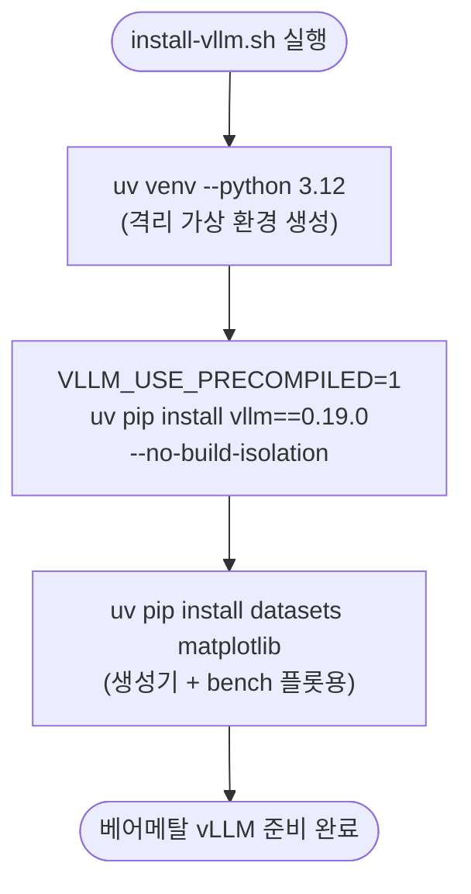

# `scripts/install-vllm.sh` 분석

Docker 없이 **베어메탈에 vLLM을 설치**하는 헬퍼입니다. `uv`로 격리된 가상 환경을
만들고 사전 컴파일된 vLLM 0.19.0 wheel과 추가 의존성을 설치합니다.

## 개요

| 항목 | 내용 |
| --- | --- |
| 목적 | Docker를 쓸 수 없는 환경의 프로파일러/bench용 vLLM 설치 |
| 도구 | `uv`(빠른 Python 패키지 관리자) |
| Python | 3.12 |
| 핵심 최적화 | `VLLM_USE_PRECOMPILED=1` — 소스 빌드 대신 사전 컴파일 wheel 사용 |

## 블록 다이어그램

## 단계별 분석

1. **가상 환경 생성** — `uv venv --python 3.12`로 Python 3.12 기반 격리 venv를
   만듭니다.
2. **vLLM 설치** — `VLLM_USE_PRECOMPILED=1`로 소스에서 컴파일하지 않고 사전 컴파일된
   wheel을 사용합니다(설치 시간 대폭 단축). torch, pydantic, pyyaml, rich는 vLLM의
   transitive 의존성으로 함께 설치되므로 별도로 나열할 필요가 없습니다.
3. **추가 의존성** — `datasets`(워크로드 생성기의 HF 데이터셋 로딩)와
   `matplotlib`(bench 플롯)을 설치합니다.

## 참고

- 기본 경로는 Docker(`docker-vllm.sh`)입니다. 이 스크립트는 Docker를 쓸 수 없을 때만
  사용하세요.
- 시뮬레이터 측 베어메탈 설치는 별도 스크립트 `scripts/install-sim.sh`가 담당합니다.
