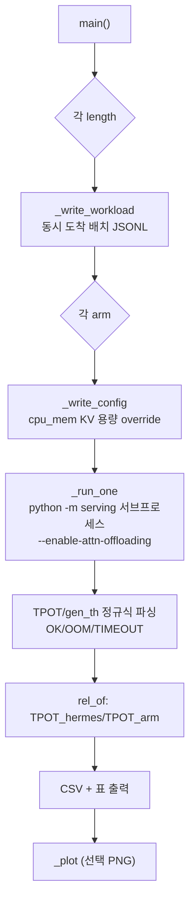

# `scripts/nelssa_fig5_sweep.py` 분석

**NELSSA 논문 Fig. 5 재현 스크립트**입니다. 프롬프트 길이를 스윕하며 각 길이에서
세 PNM arm을 시뮬레이터로 실행하고, Hermes(HC-PNM full-attention) 기준으로 정규화된
상대 decode throughput을 보고합니다(OOM은 'X'로 표시).

## 개요

| 항목 | 내용 |
| --- | --- |
| 역할 | 길이×3 arm 스윕 → 상대 decode throughput(vs Hermes) |
| arm | Hermes(HC-PNM full), NELSSA(HC-PNM sparse), CXL-PNM(HB-PNM full) |
| 지표 | Mean TPOT 역수(decode 단계 반영) |
| 실행 | `python scripts/nelssa_fig5_sweep.py --lengths ... --num-requests ...` |

## 블록 다이어그램

## 주요 구성 요소

| 요소 | 역할 |
| --- | --- |
| `_write_workload` | 동시 도착(5ms 간격) 배치 워크로드 JSONL 생성 |
| `_write_config` | 기준 config의 `cpu_mem.mem_size`(KV 용량) override |
| `_run_one` | `serving` 서브프로세스 실행 → TPOT/throughput 파싱(OK/OOM/TIMEOUT) |
| `rel_of` | Hermes 대비 상대 decode throughput(TPOT 비율) |
| `main` | 스윕 오케스트레이션 + CSV/표 출력 + 정리 |
| `_plot` | 상대 throughput vs 길이 플롯(OOM은 빨간 X) |

## 세 arm

- **Hermes(HC-PNM full)**: DDR5 ~200GB/s, 고용량 → 1x 기준.
- **NELSSA(HC-PNM sparse)**: 동일 장치 + dynamic sparse attn → 위로 스케일.
- **CXL-PNM(HB-PNM full)**: LPDDR5X ~1.1TB/s, 저용량 → 빠르나 긴 프롬프트에서 OOM.

## 참고

- 경로는 repo-root 상대여야 합니다(시뮬레이터가 `astra-sim/`로 chdir 후 `../` prefix로 해석).
- PNM 용량 override는 per-channel DIMM 크기 이상이어야 `pim_channels`가 0으로
  반올림되지 않습니다(HC-PNM 256GB, HB-PNM 16GB).
- 실행 후 `git checkout astra-sim/inputs` + 임시 파일 정리로 상태를 복원합니다.
