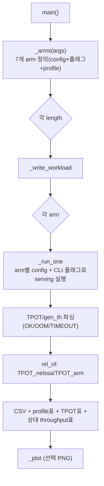

# `scripts/nelssa_strategy_sweep.py` 분석

**NELSSA 설계 공간(config-strategy) trade-off 스윕**입니다. 시뮬레이터가 모델링하는
모든 long-context KV 전략(PNM arm + host-offload/CPU baseline)을 프롬프트 길이 범위에서
실행하여, 각 전략이 어디서 이기고 어디서 무너지는지를 표로 정리합니다.

## 개요

| 항목 | 내용 |
| --- | --- |
| 역할 | 7개 KV 전략 arm × 길이 스윕 → trade-off 표 |
| 축 | compute 위치 / KV 위치 / selection(full vs sparse) / KV 전송량 |
| 지표 | Mean TPOT, NELSSA 기준 상대 decode throughput |
| 실행 | `python scripts/nelssa_strategy_sweep.py --lengths ... --num-requests ...` |

## 블록 다이어그램

## 주요 구성 요소

| 요소 | 역할 |
| --- | --- |
| `_arms` | 7개 arm 정의(label, config 키, CLI 플래그, profile 문자열) |
| `_write_workload` | 동시 도착 배치 워크로드 JSONL |
| `_run_one` | arm별 config+플래그로 `serving` 실행 → TPOT 파싱 |
| `rel_of` | NELSSA 대비 상대 decode throughput |
| `main` | 스윕 + 3종 표(profile/TPOT/상대 throughput) 출력 + 정리 |
| `_plot` | TPOT vs 길이 플롯(OOM은 X 마커) |

## 7개 arm

| arm | compute | KV 위치 | selection | 전송 |
| --- | --- | --- | --- | --- |
| GPU-only | GPU | GPU HBM | full | 없음(OOM) |
| NELSSA(HC-PNM) | PNM | PNM 1TB | sparse | query+result |
| Hermes(HC-PNM) | PNM | PNM 1TB | full | query+result |
| CXL-PNM(HB-PNM) | PNM | PNM 128G | full | query+result |
| FlexGen | GPU | host | full | 전체 KV |
| InfiniGen | GPU | host | sparse | 선택 KV |
| RetrievalAttn-CPU | CPU | host | sparse | query+result |

## 참고

- 각 arm은 상호배타적 KV 전략이라 자체 config + CLI 플래그로 구동됩니다(단일 offload
  플래그 공유 불가).
- 용량 제한 arm(GPU-only, HB-PNM)은 긴 컨텍스트에서 OOM('X')으로 표시되어 논문의
  trade-off(대역폭/HBM은 빠르나 용량 제한 vs HC-PNM+sparsity는 계속 동작)를 재현합니다.
- `--only`로 특정 arm만 스윕할 수 있습니다.
