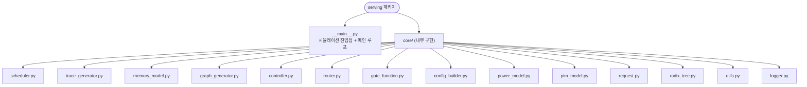

# `serving/__init__.py` 분석

`serving` 최상위 패키지의 마커/문서 모듈입니다. 실행 코드는 없고 docstring으로
**패키지 개요와 모듈 맵**을 제공합니다.

## 개요

| 항목 | 내용 |
| --- | --- |
| 역할 | 패키지 문서(모듈 맵), 실행 로직 없음 |
| 노출 API | CLI만 (`python -m serving`) |
| 내부 구현 위치 | `serving.core` |

## 블록 다이어그램

## 참고

- docstring의 모듈 맵은 저장소 구조를 한눈에 파악하는 색인 역할을 합니다.
- 외부 호출자는 `from serving.core.X import ...`로 내부 모듈에 접근합니다.
