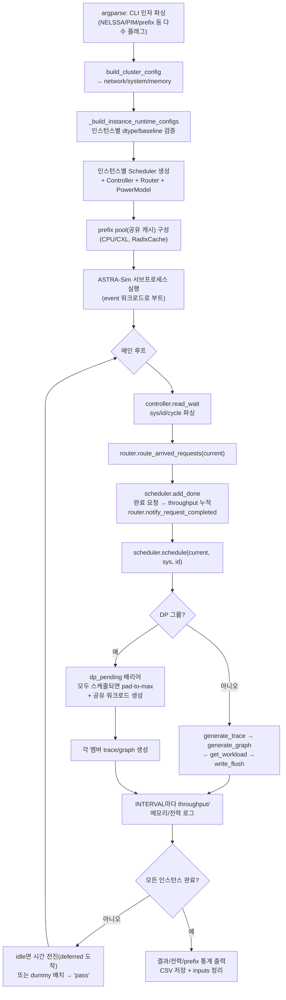

# `serving/__main__.py` 분석

**시뮬레이션 진입점 + 메인 iteration 루프**입니다. CLI 인자를 파싱하고, ASTRA-Sim
입력 파일을 생성하며, ASTRA-Sim 서브프로세스를 띄우고, `route → schedule →
trace → graph → ASTRA-Sim → add_done` 루프를 모든 요청이 끝날 때까지 돌립니다.

## 개요

| 항목 | 내용 |
| --- | --- |
| 실행 | `python -m serving --cluster-config <...> [...]` |
| 진입 함수 | `main()` |
| 작업 디렉터리 | 시작 시 `astra-sim/`로 이동(모든 상대 경로 기준점) |
| 루프 | ASTRA-Sim IPC로 한 iteration씩 진행, 완료 시 결과/전력/prefix 통계 출력 |

## 블록 다이어그램

## 주요 구성 요소

| 요소 | 역할 |
| --- | --- |
| `main()` | 전체 파이프라인 + 메인 루프 |
| `_build_instance_runtime_configs` | 인스턴스별 런타임 설정 병합·검증(NELSSA/PIM baseline 상호배타성 확인) |
| `_resolve_instance_dtype` | 인스턴스 dtype 해석(CLI → config torch_dtype → bfloat16) |
| `_pad_batch_to_max` | DP-sync용 배치 패딩(vLLM CUDA-graph DP padding 모사, decode_k_list는 미변경) |
| `_prepare_ns3_config` | ns-3 백엔드용 config.txt 생성 |
| `_cleanup_inputs_root` | 완료 후 생성된 ASTRA-Sim inputs 제거(runs/ 하위만 안전 삭제) |
| `_runtime_limit` | 0을 무한대(inf)로 변환하는 헬퍼 |

## 메인 루프 흐름

1. **읽기**: `controller.read_wait`로 ASTRA-Sim에서 `(sys, id, cycle)` 수신.
2. **라우팅**: 도착한 요청을 인스턴스로 실시간 배정.
3. **완료 처리**: `add_done`으로 배치 완료 확인 → throughput 누적, 의존 체인 방출,
   P/D 전송.
4. **스케줄링**: `schedule`로 새 배치 구성. DP 그룹이면 `dp_pending` 배리어로 모든
   멤버가 스케줄될 때까지 대기 후 pad-to-max하여 공유 워크로드 생성.
5. **트레이스/그래프**: `generate_trace → generate_graph → get_workload`로 ASTRA-Sim에
   전달(`write_flush`).
6. **로깅**: `INTERVAL`마다 prompt/gen throughput, 인스턴스/노드/CXL 메모리, 전력 출력.
7. **종료**: 모든 인스턴스가 비고 pending/deferred가 없으면 완료 표시, 전부 완료 시
   메모리 정리 후 `exit`.

## 참고

- DP 그룹 idle 인스턴스는 1토큰 dummy 배치를 만들어 ALLTOALL 동기화에 참여합니다.
- 모든 인스턴스가 idle이나 deferred 세션이 미래 도착 시각을 가지면 `current`를
  다음 도착으로 전진시켜 busy-loop을 피합니다.
- TTFT 정의는 vLLM과 다릅니다(본 시뮬레이터는 첫 토큰 **계산 완료** 시점, vLLM은
  클라이언트 수신 시점).
- baseline 플래그들은 상호배타적입니다(attn offloading / FlexGen / InfiniGen은
  경쟁적 KV 전략이라 동시 지정 시 에러).
