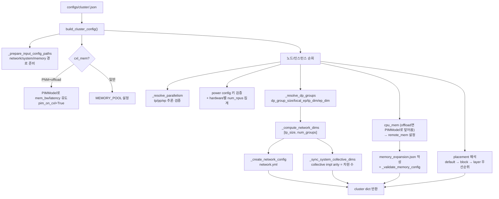

# `serving/core/config_builder.py` 분석

**클러스터 설정(JSON) → ASTRA-Sim 입력 파일 3종**을 생성하는 모듈입니다. 병렬화
차원(TP/PP/EP/DP)을 부분 정보로부터 추론·검증하고, 네트워크 토폴로지·시스템·원격
메모리 설정을 만들며, 레이어별 배치(placement)를 해석합니다.

## 개요

| 항목 | 내용 |
| --- | --- |
| 역할 | cluster config 파싱 → network.yml / system.json / memory_expansion.json 생성 |
| 진입점 | `build_cluster_config(...)` |
| 병렬화 추론 | `num_npus = tp_size × pp_size`, MoE는 `ep_size` 기본 = tp_size |
| 산출 | 인스턴스 매핑·placement·power_configs·pim_models를 담은 `cluster` dict |

## 블록 다이어그램

## 주요 구성 요소

| 요소 | 역할 |
| --- | --- |
| `build_cluster_config` | 전체 파이프라인 오케스트레이션 → `cluster` dict 반환 |
| `_resolve_parallelism` | 부분 config로부터 `tp/pp/ep_size` 추론·검증(MoE expert 나눗셈 확인) |
| `_resolve_dp_groups` | DP 그룹 검증, `dp_group_size`/`local_ep`/`tp_dim`/`ep_dim` 계산 |
| `_compute_network_dims` | ASTRA-Sim 토폴로지 차원 `[tp_size, num_groups]` 유도(후행 1 제거) |
| `_sync_system_collective_dims` | collective 구현 배열 길이를 토폴로지 차원 수에 맞춤 |
| `_create_network_config` | FullyConnected 토폴로지·대역폭·지연을 network.yml에 기록 |
| `_validate_memory_config` | placement의 모든 위치가 memory config에 존재하는지 검증 |
| `get_device` | placement 우선순위(default→block→layer)로 레이어별 장치 해석 |
| `_parse_blocks_expr` | `"0-3,5,7-9"` → 레이어 인덱스 리스트 |
| `_mem_str` | `NPU→LOCAL`, `CPU→REMOTE:{node}`, `CXL→CXL:{id}` 매핑 |

## Placement 해석

- **우선순위**: `default` < `block`(레이어 범위 규칙) < `layer`(개별 레이어 override).
- `weights`/`kv_loc`/`kv_evict_loc` 세 종류를 각각 해석하며, block override가 하나라도
  있으면 `block_mode=True`(레이어별 트레이스 재사용 불가).

## 참고

- `enable_attn_offloading`이면 `cpu_mem`의 대역폭/지연이 `PIMModel` 유도값으로
  덮어써지고, `pim-channels`가 DIMM 수 기준으로 설정됩니다.
- 이 함수는 매 실행마다 `astra-sim/inputs/`를 재생성하므로 수동 편집은 유지되지
  않습니다.
- `pim_on_cxl`이면 PNM이 CXL 계층에 있고 remote/CPU 계층은 일반 메모리로 취급됩니다.
