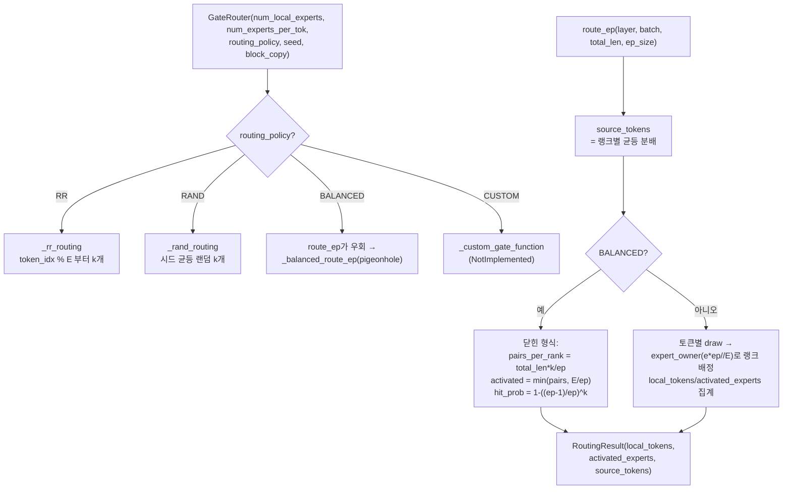

# `serving/core/gate_function.py` 분석

**MoE gate + expert dispatch를 시뮬레이터 측에서 모델링**하는 모듈입니다. 각 토큰이
어떤 expert를 활성화하고 어떤 EP 랭크로 전달되는지를 정책에 따라 계산합니다.

## 개요

| 항목 | 내용 |
| --- | --- |
| 역할 | MoE 라우팅 정책 적용 → 랭크별 토큰 수/활성 expert 산출 |
| 클래스 | `GateRouter`, `RoutingResult`(dataclass) |
| 정책 | `BALANCED`(기본), `RR`, `RAND`, `CUSTOM` |
| 최적화 | `block_copy`(기본 True) — 한 블록 라우팅을 전 레이어에 재사용 |

## 블록 다이어그램

## 주요 구성 요소

| 요소 | 역할 |
| --- | --- |
| `RoutingResult` | 랭크별 `local_tokens`(전달 토큰 수), `activated_experts`(구별 expert 수), `source_tokens`(dispatch 전 원천 토큰) |
| `expert_owner(e, ep, E)` | expert를 랭크에 균등 배정: `e * ep // E` |
| `route(...)` | EP=1일 때 expert별 flat 토큰 수 반환 |
| `route_ep(...)` | EP 인식 라우팅 — 랭크별 토큰/활성 expert 반환 |
| `_balanced_route_ep(...)` | 학습된 부하 균형 gate의 닫힌 형식(pigeonhole) 근사 |

## BALANCED 정책의 수식

- **활성 expert/랭크**: `activated_per_rank = min(round(total_len*k/ep), E/ep)` —
  포화 전에는 pair 수만큼, 포화 후에는 랭크당 expert 수로 상한.
- **랭크별 토큰**: 한 토큰이 랭크 r의 expert를 하나라도 히트할 확률
  `P = 1 − ((ep−1)/ep)^k`를 곱함. `k ≫ ep`이면 ~1로 수렴.

## 참고

- `BALANCED`는 결정적이므로 `block_copy` 최적화가 안전합니다. `RR`/`RAND`는
  포화 시 레이어별 분산이 작아 무해한 근사입니다.
- 실제 학습된 MoE gate(Qwen3, Mixtral, DeepSeek 등)는 부하 균형 정규화가 되어
  있어 서빙 시 expert별 트래픽이 근사적으로 균일하다는 가정에 기반합니다.
