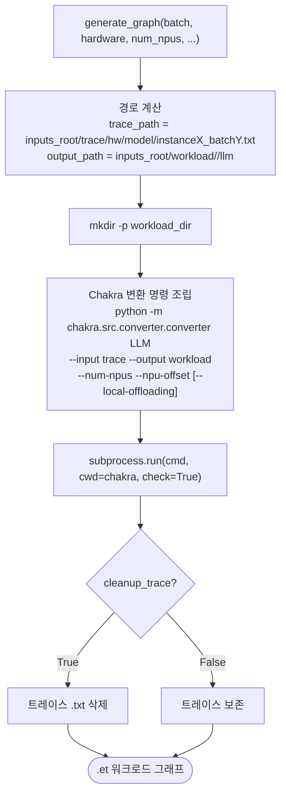

# `serving/core/graph_generator.py` 분석

텍스트 트레이스를 **Chakra protobuf `.et` 그래프로 변환**하는 모듈입니다. Chakra
변환기를 서브프로세스로 호출하여 ASTRA-Sim이 소비할 워크로드 그래프를 생성합니다.

## 개요

| 항목 | 내용 |
| --- | --- |
| 역할 | 텍스트 트레이스(.txt) → Chakra `.et` protobuf 변환 |
| 방식 | `chakra.src.converter.converter LLM` 서브프로세스 호출 |
| 진입 함수 | `generate_graph(...)` |

## 블록 다이어그램

## 단계별 분석

1. **경로 계산** — 입력 트레이스 경로(`trace/<hw>/<model>/instanceX_batchY.txt`)와
   출력 경로(`workload/<name>/llm`)를 계산합니다. DP 그룹은 `workload_name`으로
   공유 폴더에 `.et`를 씁니다.
2. **디렉터리 생성** — 워크로드 출력 디렉터리를 만듭니다.
3. **변환 명령 조립** — Chakra의 LLM 변환기를 `--num-npus`, `--npu-offset`
   인자와 함께 호출합니다. `enable_local_offloading`이면 `--local-offloading`을
   추가합니다.
4. **실행 + 정리** — `subprocess.run(..., check=True)`로 변환하고,
   `cleanup_trace=True`(기본)이면 중간 텍스트 트레이스를 삭제합니다.

## 참고

- 변환기는 `cwd=chakra`(ASTRA-Sim 내 Chakra 디렉터리)에서 실행됩니다.
- `--no-cleanup-inputs`를 쓰면 `cleanup_trace=False`가 되어 디버깅용 트레이스가
  보존됩니다.
