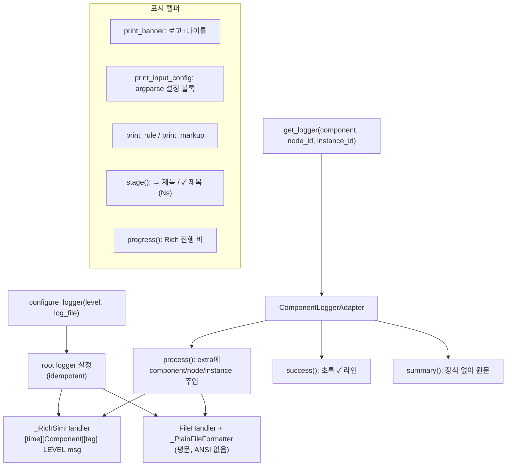

# `serving/core/logger.py` 분석

**Rich 기반 시뮬레이터 로거**입니다. 모든 시뮬레이터 출력(로그 레코드, 주기적
상태 대시보드, 결과 요약, 시작 배너)이 이 모듈을 거칩니다. 콘솔은 ANSI 컬러,
파일은 평문으로 이원화됩니다.

## 개요

| 항목 | 내용 |
| --- | --- |
| 역할 | 통합 로깅 + 상태/배너/설정 표시 헬퍼 |
| 공개 API | `configure_logger`, `get_logger`, `print_banner`, `print_input_config` 등 |
| 콘솔 | Rich `Console`(stdout, soft_wrap), 테마 기반 레벨 색상 |
| 어댑터 | `ComponentLoggerAdapter` — component/node/instance 태그 주입 |

## 블록 다이어그램

## 주요 구성 요소

| 요소 | 역할 |
| --- | --- |
| `configure_logger` | root 로거 초기화(멱등), 콘솔+선택적 파일 핸들러 부착 |
| `get_logger` | `ComponentLoggerAdapter` 반환(클래스/문자열을 component 라벨로) |
| `ComponentLoggerAdapter` | 모든 레코드에 component/node/instance 태그 주입, `success`/`summary` 확장 |
| `_RichSimHandler` | Rich로 `[시각][컴포넌트][태그] LEVEL 메시지` 렌더(summary는 원문) |
| `_PlainFileFormatter` | 파일용 평문 포매터(전체 날짜, ANSI 없음) |
| `print_banner` / `_centered_logo` | ASCII 로고+타이틀+태그라인, 터미널 폭에 맞춰 중앙 정렬 |
| `print_input_config` | argparse 네임스페이스를 사람이 읽기 좋은 설정 블록으로 표시 |
| `stage` / `progress` | 장기 실행 단계·진행 바 컨텍스트 매니저 |

## 표시 규칙

- **콘솔**: Rich 자동 감지 — TTY면 컬러, 리다이렉트/파이프면 평문.
  `FORCE_COLOR=1`로 강제 가능.
- **파일**: `>` 하나로 로그가 저장되도록 stdout 사용(ASTRA-Sim IPC는 자체 파이프라 안전).
- **`is_summary`**: 타임스탬프/prefix 없이 원문 출력(결과 요약용).

## 참고

- 라인 포맷은 원본 ANSI 구현을 유지: `[14:47:13.208] [Scheduler] [node=0,inst=1] INFO ...`.
- 브래킷 문자를 스타일 span 내부에 두어 렌더 라인이 ANSI escape로 시작하도록 함
  (에디터/로그 뷰어의 ANSI 자동 감지 대응).
