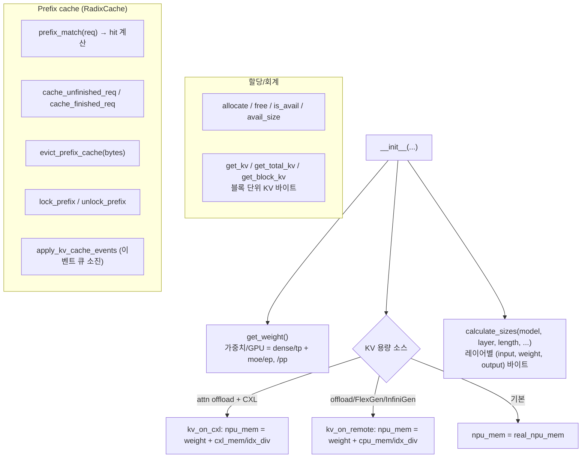

# `serving/core/memory_model.py` 분석

**NPU/CPU/CXL 메모리 회계 + KV cache + prefix cache + 텐서 크기 계산**을 담당하는
핵심 모듈입니다. 스케줄러가 언제 요청을 받을 수 있는지, prefix cache eviction이
언제 일어나는지를 결정합니다.

## 개요

| 항목 | 내용 |
| --- | --- |
| 역할 | 계층별 바이트 회계 · KV 블록 관리 · prefix cache · 레이어 텐서 크기 |
| 클래스 | `MemoryModel`, `Device`(Enum) |
| 계층 | NPU(`npu_used`), CPU(`cpu_used`), CXL(`cxl_used[]`) |
| 특수 소싱 | `kv_on_cxl`/`kv_on_remote`(offload/FlexGen/InfiniGen), `sparse_index_ratio` |

## 블록 다이어그램

## 주요 구성 요소

| 요소 | 역할 |
| --- | --- |
| `get_weight()` / `_get_weight_per_block()` | 가중치 바이트/GPU 계산(dense는 TP, MoE expert는 EP로 샤딩, PP로 나눔) |
| `get_kv` / `get_total_kv` / `get_block_kv` | 시퀀스/요청/배치의 KV 바이트를 블록 단위로 계산 |
| `allocate` / `free` / `is_avail` / `need_size` / `avail_size` | 장치별 바이트 할당·해제·가용량 조회 |
| `prefix_match(req)` | RadixCache 조회로 `prefix_cache_hit`/`npu_cache_hit`/`storage_cache_hit` 설정 |
| `cache_unfinished_req` / `cache_finished_req` | 계산된 KV 블록을 prefix cache에 삽입(`num_computed_tokens` 기반 증분) |
| `evict_prefix_cache(bytes)` | LRU 축출(2차 계층으로 spill), 계층별 `kv_size`로 바이트 계산 |
| `lock_prefix` / `unlock_prefix` / `storage_cache_evicted_req` | 멀티 청크 프리필 중 잘못된 축출 방지 lock |
| `apply_kv_cache_events` | RadixCache 이벤트 큐를 소진(CPU/CXL 2차 계층 포함) |
| `calculate_sizes(...)` | 레이어별 (input, weight, output) 텐서 바이트. `parallel`은 dense=TP, MoE=EP |
| `full_cluster_kv_bytes_per_token(...)` | config로부터 토큰당 전체 클러스터 KV 바이트 직접 계산(pool 사이징용) |

## KV 용량 소싱

- **kv_on_cxl**: CXL-attached PNM → 용량 = `cxl_mem`.
- **kv_on_remote**: remote PNM / FlexGen / InfiniGen host offload → 용량 = `cpu_mem`.
- sparse 모드에서는 `sparse_index_ratio`만큼 벡터 인덱스 풋프린트를 예약(`/idx_div`).

## 참고

- FP8 KV cache는 `kv_fp`가 1바이트(다른 경우 `fp`)로, KV 메모리를 절반으로 줄입니다.
- 회계는 NPU/CXL이 인스턴스별, CPU가 노드별입니다.
- `calculate_sizes`는 `head_dim`(명시적)·`q_dim`·`kv_dim`을 사용해 GQA/비표준
  head_dim 모델을 정확히 처리합니다.
