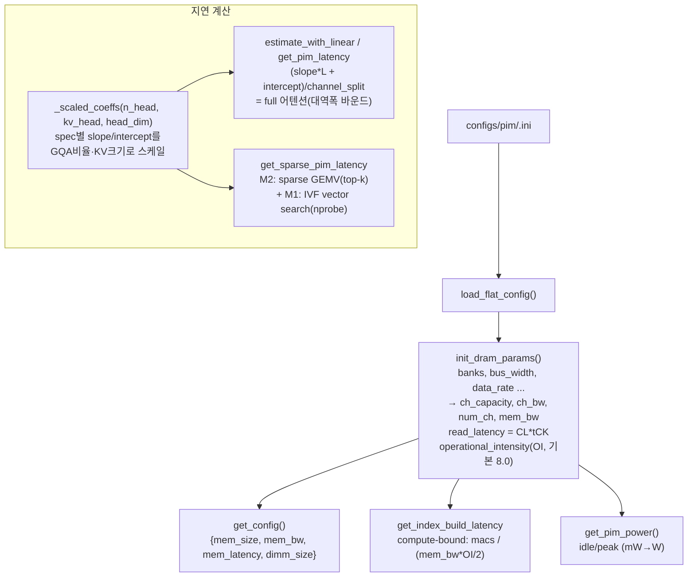

# `serving/core/pim_model.py` 분석

**PIM/PNM 장치 모델**입니다. DRAMSim3 INI 설정을 파싱하여 대역폭·지연·용량을 유도하고,
트레이스 생성기가 사용할 PIM 어텐션 지연(full/sparse)과 인덱스 빌드 비용을 계산합니다.

## 개요

| 항목 | 내용 |
| --- | --- |
| 역할 | PIM 장치의 대역폭/지연/용량 유도 + 어텐션 지연 모델 |
| 클래스 | `PIMModel` |
| 입력 | `configs/pim/<name>.ini` (DRAMSim3 형식) |
| 지연 모델 | 선형 모델(spec별 slope/intercept를 아키텍처로 스케일) |

## 블록 다이어그램

## 주요 구성 요소

| 요소 | 역할 |
| --- | --- |
| `init_dram_params()` | INI에서 채널 용량·대역폭(`ch_bw`, `mem_bw`), 읽기 지연(`CL*tCK`), operational_intensity를 유도 |
| `get_config()` | `{mem_size, mem_bw, mem_latency, dimm_size}` 반환(메모리 모델/트레이스가 소비) |
| `_scaled_coeffs(n_head, kv_head, head_dim)` | Llama-3.1-8B 기준 spec별 (slope, intercept)를 GQA 비율·KV 크기로 스케일 |
| `estimate_with_linear` / `get_pim_latency` | full 디코드 어텐션 지연 = `(slope*L + intercept)/channel_split` (대역폭 바운드) |
| `get_sparse_pim_latency(...)` | NELSSA sparse: M2(top-k GEMV) + M1(IVF vector search, keys-only 0.5배) |
| `get_index_build_latency(head_dim, n_new, kv_size)` | RetrievalAttention IVF 인덱스 빌드(compute-bound, `peak_flops = mem_bw × OI`) |

## 지연 모델 요약

- **Full 어텐션**: 전체 KV(`L`)를 스트리밍 → `(slope·L + intercept)/channel_split`.
- **Sparse 어텐션**: `k = ceil(ratio·L)` 토큰만 GEMV + `nprobe·√L` 벡터 스캔 →
  `(slope·k + intercept + 0.5·slope·vectors)/channel_split`.
- **인덱스 빌드**: `n_new × n_list × head_dim` MAC를 `peak_flops/2`로 나눔.

## 참고

- spec별 기준 계수(`DDR5_1TB_6400_pim`, `LPDDR5_HBPNM_128GB_pim` 등)는 대역폭/읽기
  지연 비율로 유도됩니다(NELSSA HC-PNM / HB-PNM).
- 모든 지연은 ns 단위로 반환됩니다.
