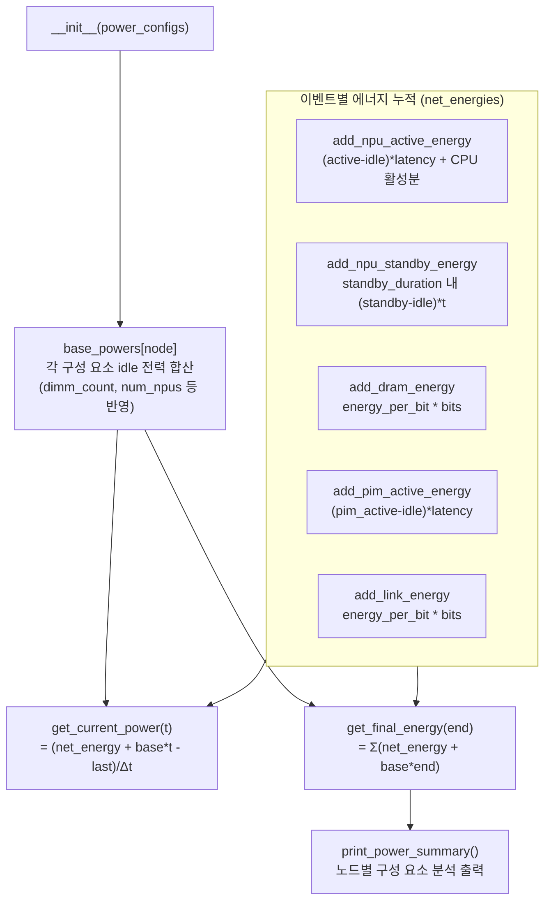

# `serving/core/power_model.py` 분석

**노드별 전력·에너지 추정 모델**입니다. 구성 요소(NPU/CPU/DRAM/Link/NIC/Storage/Base)별
base 전력과 이벤트 기반 에너지 증분을 누적하여 순간 전력과 총 에너지를 산출합니다.

## 개요

| 항목 | 내용 |
| --- | --- |
| 역할 | 구성 요소별 에너지 적분 → 순간 전력/총 에너지 |
| 클래스 | `PowerModel` |
| 에너지 = | (base 전력 × 시간) + 이벤트별 활성/전송 에너지 |
| 구성 요소 | base_node, npu, cpu, dram, link, nic, storage |

## 블록 다이어그램

## 주요 구성 요소

| 메서드 | 역할 |
| --- | --- |
| `__init__` | 설정에서 구성 요소별 base 전력 계산(CPU는 `idle + (active-idle)*util`, DRAM은 DIMM 수 반영) |
| `add_npu_active_energy_consumption` | 레이어 실행의 NPU 활성 에너지 + 동시 CPU 활성분(util 상향) |
| `add_npu_standby_energy_consumption` | 커널 종료 후 `standby_duration` 내 대기 에너지(마지막 계산 시점 대비 유효 구간 계산) |
| `add_dram_energy_consumption` / `add_link_energy_consumption` | KV/가중치 로드·collective의 `energy_per_bit × bits` |
| `add_pim_active_energy_consumption` | PIM 활성 에너지(DRAM 계층에 귀속) |
| `get_current_power(t)` | 순간 총 시스템 전력(W) — base×t + net_energy의 미분 |
| `get_final_energy(end)` | 노드별/전체 총 에너지(J) |
| `print_power_summary` | 노드별 구성 요소 에너지 트리 출력 |

## 헬퍼

- `total_ring_data(L_bytes, N, collective)` — ring collective의 총 데이터 이동량 계산.
  allreduce는 `2(N-1)S`, alltoall/allgather/reducescatter는 `(N-1)S`(`S = L/N`).
- `DEVICE_STR` / `DEVICE_SPACE` — 요약 출력용 라벨/정렬 매핑.

## 참고

- NPU standby는 상태 기계(active → standby → idle)를 시간 기반으로 모델링합니다
  (`standby_duration` ns 이내면 standby 전력, 초과 시 idle).
- 에너지 단위는 J, 전력은 W이며 pJ/bit는 `1e-12`로 환산합니다.
