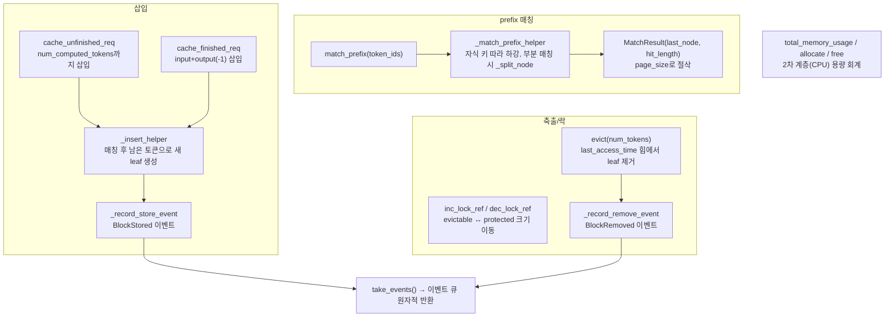

# `serving/core/radix_tree.py` 분석

**Prefix cache용 radix tree 자료구조**입니다(SGLang에서 차용). 토큰 ID 시퀀스를
공유 prefix 기준으로 트리에 저장하여 KV cache 재사용을 가능하게 하고, LRU
축출·prefix 매칭·KV cache 이벤트 큐를 관리합니다.

## 개요

| 항목 | 내용 |
| --- | --- |
| 역할 | prefix 공유 트리 · LRU 축출 · KV cache 이벤트 발행 |
| 클래스 | `RadixCache`, `TreeNode`, `KVCacheEvent`(및 하위) |
| 출처 | SGLang(Apache 2.0), 시뮬레이터용으로 각색 |
| page_size | 1이면 토큰 단위, >1이면 페이지 정렬 매칭 |

## 블록 다이어그램

## 주요 구성 요소

| 요소 | 역할 |
| --- | --- |
| `TreeNode` | 트리 노드(children/parent/key/lock_ref/last_access_time/hash_value) |
| `match_prefix` | 최장 공유 prefix 탐색 → `(last_node, hit_length)` |
| `_match_prefix_helper` / `_split_node` | 하강 매칭, 부분 매칭 시 노드 분할 |
| `cache_unfinished_req` / `cache_finished_req` | 계산된 토큰을 트리에 삽입, prefix 통계 1회 집계 |
| `insert` / `_insert_helper` | 매칭되지 않은 잔여 토큰으로 새 leaf 추가 |
| `evict(num_tokens)` | `lock_ref==0`인 leaf를 LRU 순으로 제거 |
| `inc_lock_ref` / `dec_lock_ref` | 락 참조 증감 → evictable/protected 크기 갱신 |
| `total_memory_usage` / `allocate` / `free` / `avail_size` | 2차 계층(CPU/CXL) 바이트 회계 |
| `take_events` | KV cache 이벤트 큐를 원자적으로 반환·비움 |

## 매칭 함수

- **`_key_match_page_size1`**: 토큰 단위로 처음 불일치까지의 길이.
- **`_key_match_paged`**: `page_size` 블록 단위 비교(끝의 완전 일치 잔여는 추가 흡수).

## 참고

- 통계(`total_requested_tokens`/`total_hit_tokens`)는 chunked prefill로 같은 요청이
  여러 번 삽입돼도 요청당 1회만 집계됩니다(`_prefix_*_stats_counted` 플래그).
- KV cache 이벤트(`BlockStored`/`BlockRemoved`/`AllBlocksCleared`)는 `msgspec` 구조로
  `enable_kv_cache_events`일 때만 큐잉되어 중앙 prefix 공유에 사용됩니다.
- 크기(`evictable_size`/`protected_size`/`total_size`)는 바이트가 아닌 **토큰 수**입니다.
