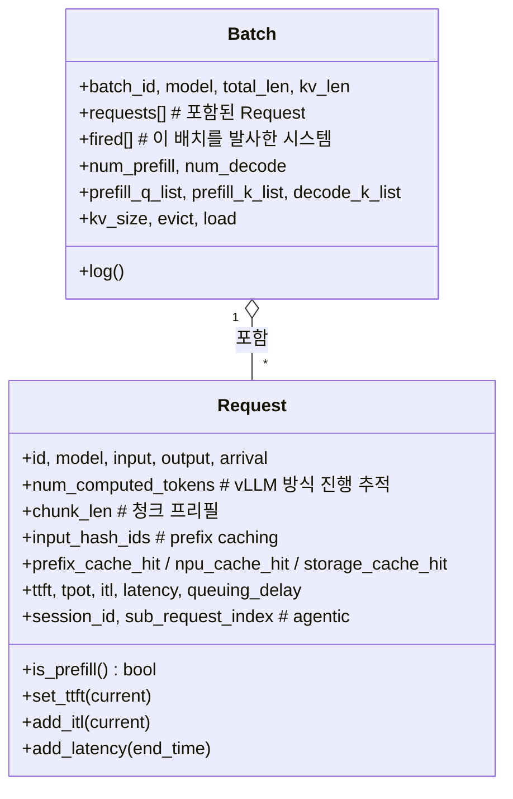

# `serving/core/request.py` 분석

시뮬레이터의 핵심 데이터 클래스 **`Request`(요청)**와 **`Batch`(배치)**를 정의하는
모듈입니다. 요청별 상태·지연 지표와 한 반복의 배치 상태를 담습니다.

## 개요

| 항목 | 내용 |
| --- | --- |
| 역할 | 요청/배치 상태 및 지연 지표(TTFT/TPOT/ITL) 관리 |
| 클래스 | `Request`, `Batch` |
| 규약 | 모든 속성을 `__init__`에서 초기화(getattr 폴백 금지) |

## 블록 다이어그램

## 주요 구성 요소

### `Request`
| 그룹 | 속성/메서드 |
| --- | --- |
| 기본 | `id`, `model`, `input`(원본 길이 유지), `output`, `arrival`, `instance_id` |
| 진행 | `num_computed_tokens`(vLLM 스타일), `original_input`, `is_prefill()` |
| 청크 프리필 | `chunk_len` |
| Prefix cache | `input_hash_ids`, `prefix_cache_hit`, `npu/storage_cache_hit`, `*_last_node`, `_prefix_locked` |
| 지연 지표 | `set_ttft`, `add_itl`, `add_latency`(TTFT/TPOT/latency 계산), `set_que_delay` |
| Agentic | `session_id`, `sub_request_index`(정보용, 스케줄링 미구동) |

### `Batch`
한 반복에 스케줄된 요청들을 집계. `total_len`(이번 스텝 토큰 합), `kv_len`,
prefill/decode 분리 리스트(`prefill_q_list` 등), `fired`(트레이스 중복 생성 방지),
`kv_size`/`evict`/`load`(메모리 회계)를 담습니다.

## 참고

- `add_latency`에서 `output == input + 1`(디코드 1토큰)이면 TPOT를 0으로 처리합니다.
- 모든 속성이 `__init__`에서 초기화되어 있어 `getattr` 폴백 없이 직접 접근합니다
  (프로젝트 규약).
