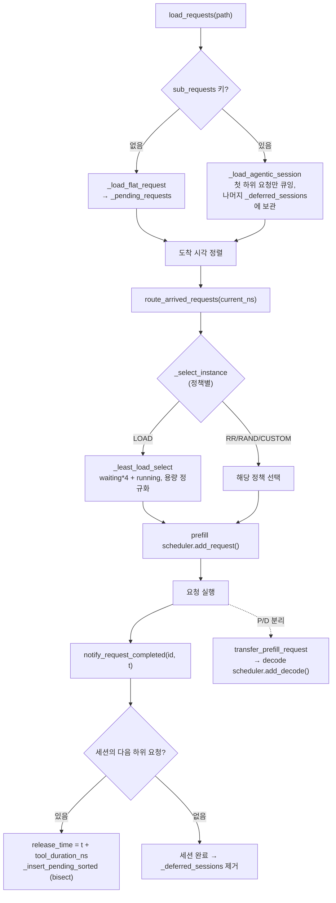

# `serving/core/router.py` 분석

**인스턴스 간 요청 라우팅**과 **agentic 세션 의존성 체인**을 관리하는 모듈입니다.
요청을 도착 시각에 맞춰 실시간으로 인스턴스에 배정하고, 세션의 하위 요청을 순차
방출합니다.

## 개요

| 항목 | 내용 |
| --- | --- |
| 역할 | 실시간 요청 라우팅 + P/D 전송 + agentic 의존성 추적 |
| 클래스 | `Router` |
| 라우팅 정책 | `RR`, `RAND`, `LOAD`(기본 vLLM식), `CUSTOM` |
| 데이터 형식 | flat 요청 / agentic 세션(`sub_requests`) 자동 감지 |

## 블록 다이어그램

## 주요 구성 요소

| 요소 | 역할 |
| --- | --- |
| `_rr_select` / `_rand_select` / `_least_load_select` / `_custom_select` | 정책별 인스턴스 선택. LOAD는 `waiting*4 + running`을 `max_num_seqs`로 정규화한 점수 최소값 |
| `load_requests` | JSONL을 flat/agentic으로 자동 감지하여 로드, 도착 시각 정렬 |
| `_load_agentic_session` | 첫 하위 요청만 큐에, 나머지는 `_deferred_sessions`에 세션 상태로 저장 |
| `route_arrived_requests(t)` | `arrival <= t`인 요청을 prefill 인스턴스로 라우팅 |
| `notify_request_completed(id, t)` | 하위 요청 완료 시 다음을 `t + tool_duration_ns`에 방출 |
| `_insert_pending_sorted` | 미소비 구간에 이진 탐색으로 정렬 삽입 |
| `transfer_prefill_request` | P/D 분리에서 완료된 프리필을 decode 인스턴스로 전송 |
| `has_pending_requests` / `has_deferred_sessions` / `get_next_pending_arrival` | 종료 판정·시간 전진용 상태 조회 |

## 참고

- prefill/decode 스케줄러를 `pd_type`으로 분리하며, 프리필 라우팅과 P/D 전송에서
  각각 RR 카운터를 별도 유지합니다.
- `generate()`는 legacy 일괄 라우팅(도착 시각 무시)으로 하위 호환용입니다.
