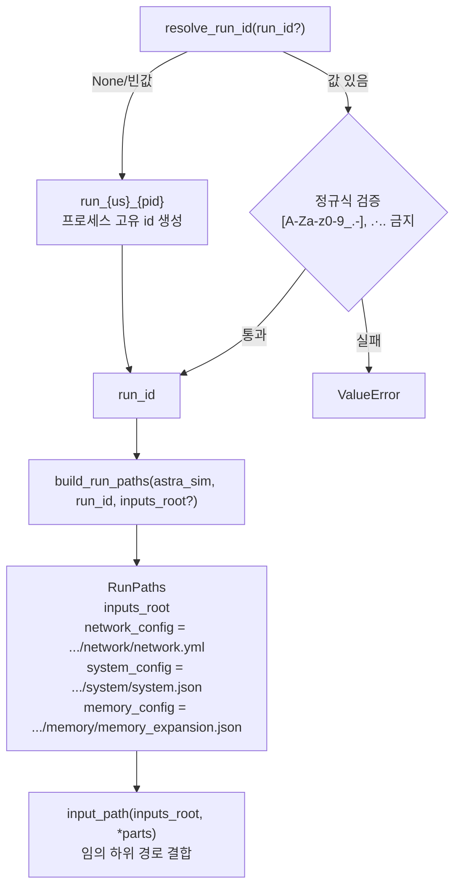

# `serving/core/run_paths.py` 분석

**run별 ASTRA-Sim 입력 경로**를 계산·관리하는 모듈입니다. 병렬 시뮬레이션이 서로의
중간 파일을 덮어쓰지 않도록 run마다 고유한 입력 루트를 부여합니다.

## 개요

| 항목 | 내용 |
| --- | --- |
| 역할 | run id 검증/생성, ASTRA-Sim 입력 경로(network/system/memory) 구성 |
| 핵심 자료구조 | `RunPaths`(frozen dataclass) |
| 안전성 | run id 문자 제약 정규식(`[A-Za-z0-9_.-]`), `.`/`..` 금지 |

## 블록 다이어그램

## 주요 구성 요소

| 요소 | 역할 |
| --- | --- |
| `RunPaths` | run_id + 3개 ASTRA-Sim 설정 파일 절대 경로를 담는 불변 dataclass |
| `resolve_run_id(run_id=None)` | 미지정 시 `run_{마이크로초}_{PID}`로 프로세스 고유 id 생성; 지정 시 경로 안전 문자만 허용 |
| `build_run_paths(astra_sim, run_id, inputs_root=None)` | 기본 `astra-sim/inputs/runs/<run_id>` 아래에 network/system/memory 경로 구성 |
| `input_path(inputs_root, *parts)` | 입력 루트 기준 하위 경로 결합 헬퍼 |

## 참고

- run id 미지정 시 마이크로초 타임스탬프 + PID로 병렬 실행 충돌을 방지합니다.
- `--inputs-root`로 중간 파일을 로컬 SSD/tmpfs에 둘 수 있습니다.
