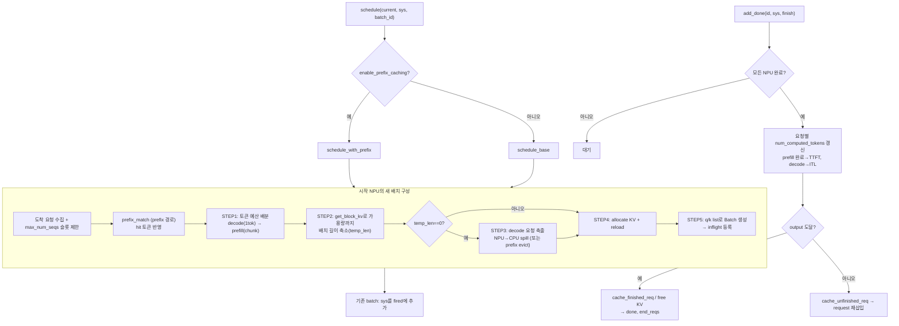

# `serving/core/scheduler.py` 분석

**vLLM 스타일 continuous batching 스케줄러**입니다. 매 iteration마다 메모리와
토큰 예산 제약 하에 배치를 구성하고, chunked prefill·prefix cache·eviction을
처리하며, 완료된 요청의 상태와 지표를 갱신합니다.

## 개요

| 항목 | 내용 |
| --- | --- |
| 역할 | 배치 구성 · KV 할당/축출 · chunked prefill · 완료 처리 |
| 클래스 | `Scheduler` |
| 배치 정책 | decode 우선 → prefill(chunked), `max_num_batched_tokens`/`max_num_seqs` 예산 |
| 소유 | 인스턴스별 `MemoryModel` 1개, 요청 큐(`request`/`inflight`/`done`) |

## 블록 다이어그램

## 주요 구성 요소

| 요소 | 역할 |
| --- | --- |
| `schedule` | prefix caching 여부로 `schedule_with_prefix`/`schedule_base` 분기 |
| `schedule_base` | prefix cache 없는 배치 구성 (토큰 예산 → KV 가용성 → NPU→CPU 축출 → 할당) |
| `schedule_with_prefix` | RadixCache prefix 매칭 + lock/unlock, prefix evict(2차 계층 spill) 포함 |
| `_get_reload_size` | 축출됐던(`evict`) 요청을 다시 로드할 KV 바이트 합 |
| `add_done` | 배치 완료 처리 — 모든 NPU 도달 확인 후 상태 전이, `prompt_t`/`gen_t`/`end_reqs` 반환 |
| `add_request` / `add_decode` | 도착 요청 삽입(`bisect.insort`로 정렬), P/D decode 인스턴스 수용 |
| `_merge_by_arrival_id` | prefill 우선 시 pool과 request 큐를 도착순 병합 |
| `print_result` / `save_output` | TTFT/TPOT/ITL 통계 출력, per-request CSV 저장 |

## 배치 구성 5단계 (STEP 1~5)

1. **토큰 예산 배분**: chunked면 decode(각 1토큰) 먼저, 그 다음 prefill을
   `long_prefill_token_threshold`로 청크 상한을 두고 `max_num_batched_tokens`까지.
2. **KV 크기 계산**: `get_block_kv`로 배치 뒤에서부터 줄여가며 NPU 가용량에 맞춤.
3. **축출**: 공간 부족 시 decode 요청을 뒤에서부터 preempt. base 경로는 NPU→CPU
   spill(`allocate(size*num_npus, CPU)`), prefix 경로는 `evict_prefix_cache`.
   `kv_on_remote`면 하위 계층이 없어 `None` 반환으로 백오프.
4. **할당**: 최종 배치의 KV를 NPU에 할당, 축출됐던 KV를 reload(CPU에서 회수).
5. **Batch 생성**: `q_list`/`prefill_k_list`/`decode_k_list` 등을 채워 `Batch`
   객체 생성 후 `inflight`에 등록.

## 참고

- `add_done`은 PP/TP를 고려해 시작·끝 NPU가 모두 `batch.end`에 있어야 완료로 처리합니다
  (prefill 인스턴스는 sender NPU를 위해 `num_npus*2`).
- prompt throughput(`prompt_t`)은 prefix cache hit 토큰을 포함합니다(vLLM 동작 일치).
- full prefix hit 요청은 prefill 단계를 건너뛰므로 decode 진입 시 `is_init` 정리와
  prefix lock을 한 번에 처리합니다.
