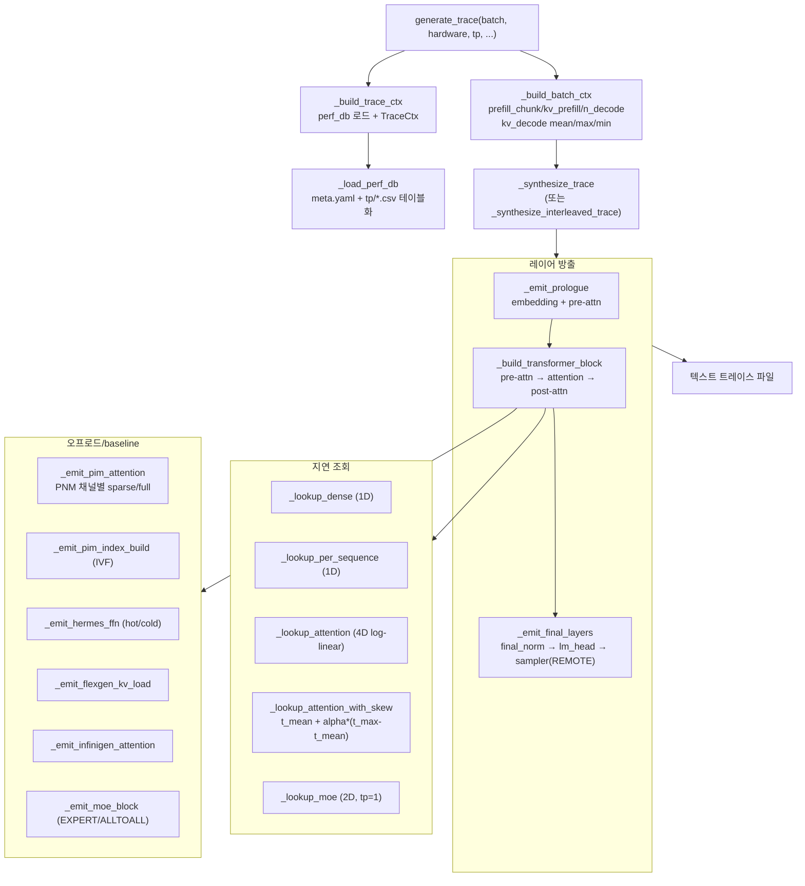

# `serving/core/trace_generator.py` 분석

**프로파일된 지연 데이터로부터 실행 트레이스(텍스트)를 생성**하는 모듈입니다.
아키텍처 yaml의 `sequence:`를 순회하며 레이어별 지연을 조회하고, TP/EP collective·
PIM 어텐션·NELSSA baseline(sparse/Hermes/FlexGen/InfiniGen)을 트레이스에 반영합니다.

## 개요

| 항목 | 내용 |
| --- | --- |
| 역할 | perf DB 로드/조회 + 아키텍처 순회 → Chakra 입력 텍스트 트레이스 |
| 진입점 | `generate_trace`, `generate_event`, `_synthesize_(interleaved_)trace` |
| perf DB | `_load_perf_db` — 카테고리별 CSV(dense/per_sequence/attention/moe) 캐시 |
| 조회 | 1D(dense/per_seq), 4D(attention, skew 보정), 2D(moe) |

## 블록 다이어그램

## 주요 구성 요소

| 요소 | 역할 |
| --- | --- |
| `resolve_variant` | dtype/kv_cache_dtype → 프로파일 variant 폴더명(프로파일러와 일치) |
| `_load_perf_db` / `_read_category_csv` | 카테고리별 CSV를 조회 테이블로 로드·캐시(us→ns 변환) |
| `_build_attention_table` / `_build_moe_table` / `_build_1d_table` | 조회용 축별 그리드 구성 |
| `_lookup_dense` / `_lookup_per_sequence` | 1D 선형 보간(외삽 허용) |
| `_lookup_attention` | `(prefill_chunk, kv_prefill, n_decode, kv_decode)` 4D log-선형 보간 |
| `_lookup_attention_with_skew` / `_skew_alpha` | 이질적 decode kv 길이의 skew 보정(5축 버킷 alpha) |
| `_lookup_moe` | `(tokens, activated_experts)` 2D 조회(tp=1 기준) |
| `_build_trace_ctx` / `_build_batch_ctx` | `TraceCtx`/`BatchCtx` 생성(모델·병렬화·NELSSA 파라미터 포함) |
| `_emit_layer` | 한 레이어 방출: 지연 조회 + 크기 계산 + power 누적 + 포맷 |
| `_emit_pim_attention` | PNM 채널별 decode 어텐션(sparse/full, GPU-local window 분할) |
| `_emit_moe_block` | `EXPERT i`/`EXPERT END` 마커 + EP ALLTOALL 방출 |
| `_emit_hermes_ffn` / `_emit_flexgen_kv_load` / `_emit_infinigen_attention` | baseline별 FFN/KV 전송/부분 어텐션 방출 |
| `generate_trace` / `generate_event` | 트레이스 파일 생성 진입점, ASTRA-Sim 이벤트 생성 |
| `_attn_load_balancer` | decode 요청을 PNM 채널에 분배(채널별 길이 리스트) |

## 조회 세부

- **skew 보정**: 배치의 decode kv 길이가 이질적일 때 `t_mean`과 `t_max`를 두 번
  조회하고, `meta.yaml::skew_fit`에서 5축 버킷 키
  (`pc|n|skew_rate|kv_big|kp`)로 alpha를 해석해 블렌딩합니다.
- **TP collective**: `o_proj`/`down_proj` 뒤에 ALLREDUCE, MoE는 ALLTOALL을 붙이며
  `involved_dim`을 `comm_type:1,0` 형태로 인코딩(`_with_dim`).
- **PIM tier**: `pim_on_cxl`이면 `CXL:{...}`, 아니면 `REMOTE:{...}`를 대상으로 함.

## 참고

- `TraceCtx`는 NELSSA baseline 파라미터를 모두 담습니다(sparse_attention_ratio,
  attention_local_window/sink, hermes_hot_ratio, flexgen_host_offload,
  infinigen_prefetch_ratio, retrieval_cpu_sparse 등).
- 모든 조회는 clamp가 아닌 **외삽**(선형 연장)하며, 런타임 배치 한도가 프로파일
  스윕을 초과하면 `warn_if_runtime_exceeds_profiled`가 1회 경고합니다.
- MoE는 항상 tp=1에서 프로파일된 단일 랭크 관점을 EP 랭크별 토큰 수로 조회합니다.
