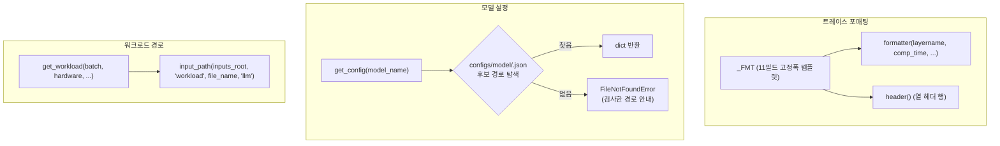

# `serving/core/utils.py` 분석

**모델 설정 로딩, 트레이스 행 포매팅, 워크로드 경로** 헬퍼를 모은 유틸리티
모듈입니다.

## 개요

| 항목 | 내용 |
| --- | --- |
| 역할 | 트레이스 행 포맷팅 · 모델 config 로드 · 워크로드 경로 생성 |
| 핵심 상수 | `_FMT` — 트레이스 파일의 11필드 정식 행 템플릿 |
| 주요 함수 | `get_config`, `formatter`, `header`, `get_workload` |

## 블록 다이어그램

## 주요 구성 요소

| 요소 | 역할 |
| --- | --- |
| `_FMT` | Layername·comp_time·input/weight/output loc·size·comm_type·comm_size·misc의 고정폭 행 템플릿(트레이스 writer들이 공통 임포트) |
| `formatter(...)` | 위 템플릿으로 트레이스 한 줄을 포맷 |
| `header()` | 트레이스 열 헤더 문자열 생성 |
| `get_workload(batch, hardware, ...)` | `<hardware>/<model>/instanceX_batchY` 형태의 워크로드 경로 계산 |
| `get_config(model_name)` | `configs/model/<name>.json`을 저장소 루트/serving 루트 후보에서 로드, 실패 시 검사 경로를 담은 오류 |

## 참고

- 파일 하단의 `if __name__ == "__main__"` 블록은 `get_config`를 단독 실행해 보는
  간단한 자체 테스트입니다.
- `get_config`는 두 후보 경로를 순차 시도하여 실행 위치에 견고합니다.
