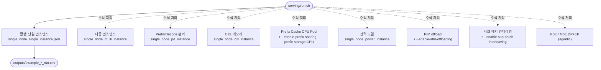

# `serving/run.sh` 분석

시뮬레이터의 **주요 시나리오별 실행 예제 모음**입니다. 스크립트라기보다 복사해서
쓰는 참조 명령 카탈로그로, 첫 번째 단일 인스턴스 예제만 활성화되어 있고 나머지는
주석 처리되어 있습니다.

## 개요

| 항목 | 내용 |
| --- | --- |
| 목적 | `python -m serving`의 대표 시나리오 명령 모음 (복사·편집용) |
| 활성 예제 | 단일 인스턴스(single_node_single_instance) |
| 공통 인자 | `--dtype float16 --block-size 16 --dataset workloads/example_trace.jsonl --num-req 10` |
| 특징 | 시나리오별로 `--cluster-config`와 기능 플래그만 다름 |

## 블록 다이어그램

## 시나리오 카탈로그

| 시나리오 | 클러스터 설정 | 추가 플래그 |
| --- | --- | --- |
| 단일 인스턴스 (활성) | `single_node_single_instance.json` | 기본(prefix caching 기본 켜짐) |
| 다중 인스턴스 | `single_node_multi_instance.json` | — |
| Prefill/Decode 분리 | `single_node_pd_instance.json` | — |
| CXL 메모리 | `single_node_cxl_instance.json` | — |
| Prefix Cache CPU Pool (단일 노드) | `single_node_multi_instance.json` | `--enable-prefix-caching --enable-prefix-sharing --prefix-storage CPU` |
| Prefix Cache CPU Pool (듀얼 노드) | `dual_node_multi_instance.json` | 동일 |
| 전력 모델 | `single_node_power_instance.json` | `--log-interval 0.1` |
| PIM offload | `single_node_pim_instance.json` | `--enable-attn-offloading` |
| 서브 배치 인터리빙 | `single_node_pim_instance.json` | `--enable-attn-offloading --enable-sub-batch-interleaving` |
| MoE | `single_node_moe_single_instance.json` | — |
| MoE DP+EP (agentic SWE-bench) | `single_node_moe_dp_ep_instance.json` | `--num-req 1`(세션 수) + SWE-bench 데이터셋 |

하단에는 **Deprecated 예제**(구 prefix caching, WIP인 NS-3 백엔드)가 참조용으로
주석 처리되어 있습니다.

## 참고

- 원하는 시나리오의 주석을 해제하거나 블록을 복사하여 자신의 스크립트에 붙여 쓰는
  용도입니다.
- agentic 워크로드(SWE-bench)에서 `--num-req`는 하위 요청이 아니라 **세션 수**를
  의미합니다.
- 각 시나리오의 개념적 설명은 문서 사이트의 **Examples** 섹션을 참고하세요.
