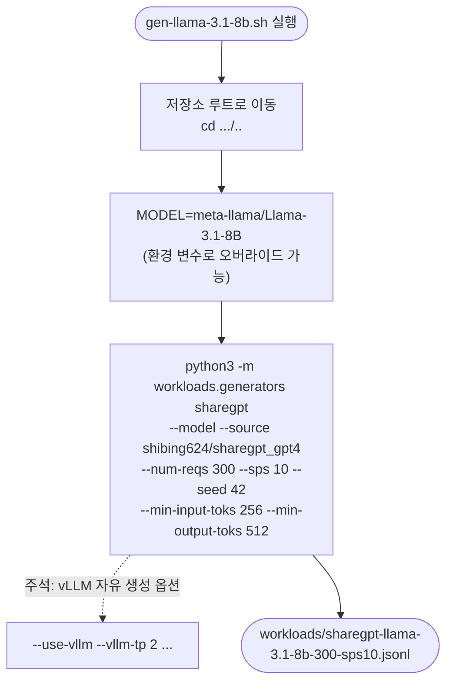

# `workloads/examples/gen-llama-3.1-8b.sh` 분석

Llama-3.1-8B용 **ShareGPT 워크로드 JSONL을 생성**하는 템플릿 스크립트입니다.
`python -m workloads.generators sharegpt`를 고정 인자로 호출합니다.

## 개요

| 항목 | 내용 |
| --- | --- |
| 목적 | `sharegpt-llama-3.1-8b-300-sps10.jsonl` 생성 |
| 실행 위치 | vLLM Docker 컨테이너(`/workspace`) |
| 모델 | `meta-llama/Llama-3.1-8B` (게이트됨 → `HF_TOKEN` 필요) |
| 소스 데이터셋 | `shibing624/sharegpt_gpt4` |

## 블록 다이어그램

## 주요 인자

| 인자 | 값 | 의미 |
| --- | --- | --- |
| `--model` | `$MODEL` | 토큰화(및 선택적 자유 생성)에 사용 |
| `--source` | `shibing624/sharegpt_gpt4` | HF 소스 데이터셋 |
| `--num-reqs` / `--sps` | 300 / 10 | 요청 수 / 초당 세션(푸아송 도착) |
| `--seed` | 42 | 재현성 시드 |
| `--min-input-toks` / `--min-output-toks` | 256 / 512 | 너무 짧은 대화 필터링 |
| `--output` | sharegpt-llama-3.1-8b-300-sps10.jsonl | 출력 파일 |

## 단계별 분석

1. **저장소 루트 이동** — `cd "$(dirname "${BASH_SOURCE[0]}")/../.."`로 저장소
   루트로 이동합니다.
2. **모델 지정** — `MODEL="${MODEL:-meta-llama/Llama-3.1-8B}"`로 기본 모델을
   정하되 환경 변수로 오버라이드 가능합니다.
3. **생성 실행** — ShareGPT 생성기를 고정 인자로 호출하여 300개 요청을 토큰화된
   flat JSONL로 생성합니다. 하단 주석의 `--use-vllm` 등을 해제하면 실제 vLLM으로
   출력을 자유 생성할 수 있습니다.

## 참고

- Llama 3.x는 게이트 모델이므로 컨테이너 환경에 `HF_TOKEN`이 설정되어 있어야 합니다.
- 기본은 tokenizer 전용 모드(출력은 ShareGPT 응답 토큰). `--use-vllm`은 실제 모델로
  출력을 재생성합니다.
