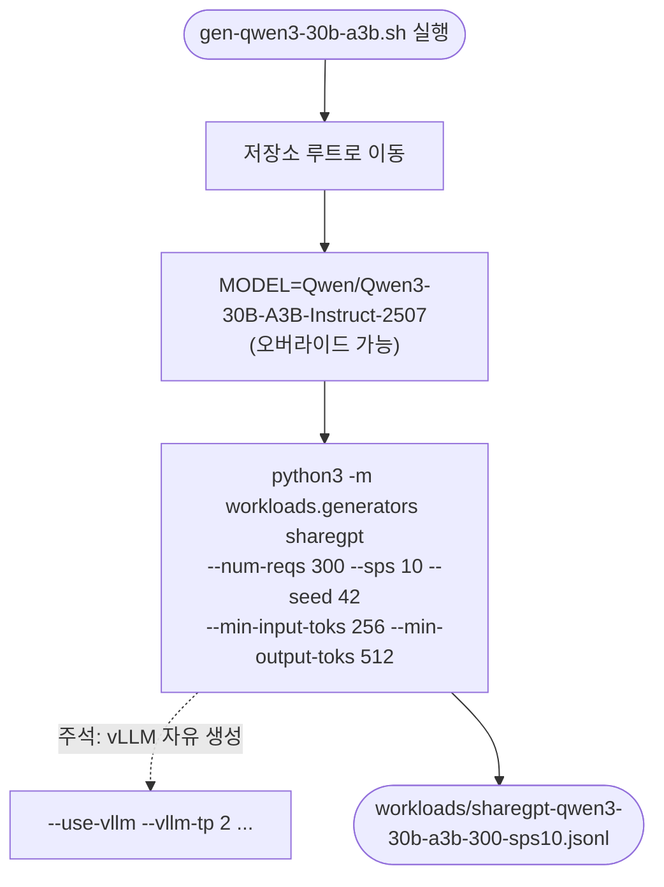

# `workloads/examples/gen-qwen3-30b-a3b.sh` 분석

Qwen3-30B-A3B-Instruct-2507(MoE) 모델용 **ShareGPT 워크로드 JSONL을 생성**하는
템플릿 스크립트입니다.

## 개요

| 항목 | 내용 |
| --- | --- |
| 목적 | `sharegpt-qwen3-30b-a3b-300-sps10.jsonl` 생성 |
| 실행 위치 | vLLM Docker 컨테이너(`/workspace`) |
| 모델 | `Qwen/Qwen3-30B-A3B-Instruct-2507` (MoE) |
| 소스 데이터셋 | `shibing624/sharegpt_gpt4` |

## 블록 다이어그램

## 단계별 분석

- `gen-llama-3.1-8b.sh`와 **구조가 동일**하며, 모델 id와 출력 파일명만 다릅니다.
- MoE expert는 TP 하에서 복제(replicate)되므로, 이 오프라인 배치 생성에는
  expert-parallel이 필요 없습니다(주석의 `--vllm-tp 2` 참고).
- `--model`은 HF id(캐시로 자동 다운로드) 또는 로컬 체크포인트 경로를 받습니다.

## 참고

- 주요 인자(`--num-reqs 300 --sps 10 --seed 42 --min-input-toks 256
  --min-output-toks 512`)는 세 예제 스크립트가 공통으로 사용합니다.
- 자유 생성이 필요하면 하단 주석의 vLLM 옵션을 해제하세요.
